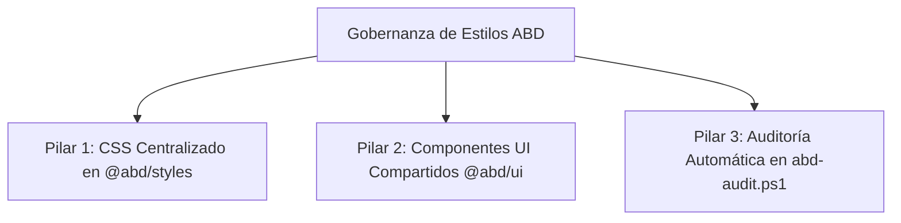

# 🎨 Auditoría de Apariencia Gráfica y Gobernanza de Estilos

Este documento detalla el análisis del desfase visual entre las aplicaciones principales de la suite (**ABDAuth**, **ABDQuiz** y **ABDtenantGobernance**), evalúa si la guía `STYLE_GUIDE.md` actual es suficiente y propone un plan definitivo para lograr una uniformidad del 100% a través de la centralización y la automatización.

---

## 🔍 1. Resultados de la Auditoría Gráfica

Al revisar los archivos de configuración de estilos y los componentes raíz, se identifican las siguientes discrepancias y razones del desfase visual:

### A. Tipografía y Fuentes Base
*   **Drift**: 
    *   `ABDQuiz` y `ABDtenantGobernance` utilizan la tipografía **Geist** (`--font-sans`) y **Geist Mono** (`--font-mono`).
    *   `ABDAuth` utiliza **Inter** (`'Inter', system-ui, sans-serif`) para el cuerpo y no tiene configurada una fuente monospace para elementos técnicos en la configuración inline de Tailwind.
*   **Impacto**: Sensación visual distinta en el renderizado de textos y números. La fuente Geist evoca una consola técnica de forma mucho más lograda que Inter, que es una tipografía SaaS comercial común.

### B. Mapeo de Variables HSL Base (Valores por Defecto)
*   **Discrepancia en Fondos**:
    *   `ABDQuiz` y `ABDtenantGobernance` definen el fondo abisal oscuro como `--background: 0 0% 4%` y las tarjetas como `--card: 0 0% 8%`.
    *   `ABDAuth` define el fondo como `--background: 0 0% 3%` y las tarjetas como `--card: 0 0% 4%`.
*   **Patrones de Rejilla (`bg-industrial-grid`)**:
    *   En `ABDQuiz`/`Gobernanza`, se utiliza `oklch(var(--border) / 0.1)` dentro de un archivo `patterns.css`.
    *   En `ABDAuth`, se define inline en `globals.css` usando `hsl(var(--foreground) / 0.08)`.
*   **Impacto**: El contraste y tono de fondo de la consola de `ABDAuth` es más oscuro y carece del sutil matiz del patrón geométrico alineado de los otros dos satélites.

### C. Duplicación y Drift de Componentes Críticos (Sidebar y Settings)
*   Tanto `TacticalSidebar` como `SystemSettings` son copias literales con ligeras variaciones locales (rutas específicas, llamadas a hooks de logout locales como `signOut` de `next-auth/react` en `ABDAuth` vs llamadas de redirección estándar en los otros).
*   **Impacto**: Si realizas una mejora de accesibilidad (A11y) o un cambio visual en el sidebar de gobernanza, este no se refleja en la autenticación ni en los exámenes a menos que lo copies y pegues manualmente. Esto garantiza que las aplicaciones terminen desalineándose.

### D. Layouts y Estructura de Cabeceras
*   `ABDAuth` (en `/dashboard/page.tsx` y layouts) utiliza estructuras de títulos clásicas (`text-2xl font-black uppercase italic`), pero no implementa los breadcrumbs monospace con animación de pulso (`CONSOLA DE CONTROL • [PÁGINA]`) ni los botones de retroceso asépticos (`ArrowLeft` encuadrados sin redondear) especificados en la guía de estilos.

---

## ❓ 2. Evaluación de `STYLE_GUIDE.md`

### ¿Es suficiente por sí sola?
> [!WARNING]
> **No por sí sola.** La guía `STYLE_GUIDE.md` es un excelente chasis conceptual y define con gran precisión las "leyes de hierro" visuales (casing, padding, headers, etc.). Sin embargo, al ser un documento puramente descriptivo, depende de la memoria y la disciplina manual del desarrollador. No evita que surjan desvíos por despistes o copy-paste.

Para que sea efectiva, debe estar respaldada por un **mecanismo físico de sincronización** y un **pipeline de validación automática**.

---

## 🛠️ 3. Propuesta de Gobernanza y Sincronización de Estilos

Para garantizar que toda la suite use exactamente los mismos estilos y evitar desvíos en el futuro, proponemos tres pilares técnicos:



### Pilar 1: CSS Centralizado en `@abd/styles`
En lugar de que cada aplicación declare su propio chasis CSS en `globals.css`, centralizaremos las utilidades de consola industrial en la biblioteca compartida.

1.  **Crear el archivo base**: Añadir `src/styles/industrial-core.css` dentro de `ABDStyles` que declare:
    *   Las variables de fuente predeterminadas (Geist y Geist Mono).
    *   La utilidad de rejilla `.bg-industrial-grid` y el fundido `.mask-industrial-fade`.
    *   La textura de ruido `.bg-grain`.
    *   La clase de paneles de cristal `.glass-panel`.
    *   El estilo de scrollbars industriales unificados.
    *   Los estilos de botones base (`.btn-primary-console`, `.btn-skip-console`).
2.  **Distribución**: Compilar este CSS en la carpeta `dist/styles/` de la biblioteca.
3.  **Consumo Simplificado**: El archivo `globals.css` de cada proyecto se reducirá a:
    ```css
    @import "tailwindcss";
    @import "@abd/styles/dist/styles/industrial-core.css";
    ```
    Cualquier ajuste de contraste en el fondo abisal o cambio en la rejilla se actualizará en toda la suite con un simple `npm update @abd/styles`.

### Pilar 2: Centralización de Componentes Interactivos (`@abd/ui`)
Para evitar el drift de la barra lateral (`TacticalSidebar`) y el menú de ajustes (`SystemSettings`):

1.  **Exportación desde la Biblioteca**: Modificar `@abd/styles` (o crear un paquete modular `@abd/ui` en el mismo repositorio) para exportar componentes de React unificados.
2.  **Abstracción de Rutas**: El componente `TacticalSidebar` no debe tener rutas hardcodeadas. Se debe parametrizar pasándole la lista de enlaces como propiedad (`props`):
    ```tsx
    // Componente centralizado en la biblioteca
    export function TacticalSidebar({ user, links, logoUrl, onLogout }) { ... }
    ```
3.  **Abstracción de Traducciones**: Pasar las etiquetas ya traducidas desde el proyecto contenedor, manteniendo el componente centralizado 100% puro y agnóstico de la configuración interna de `next-intl`.

### Pilar 3: Auditoría Estática en el Pipeline de Calidad
Añadir validaciones automatizadas al script de compilación `abd-audit.ps1` (mediante llamadas a scripts JS en la fase de análisis estático `arch-guard`):

*   **Filtro de Colores Hardcodeados**: Validar que los archivos `.tsx` no contengan strings con colores fijos (ej. `#ffffff`, `bg-neutral-900`, `text-blue-500`). Obligar a usar tokens (`bg-card`, `text-primary`, `border-border`).
*   **Filtro de Radios de Borde**: Alertar si se encuentran clases como `rounded-md`, `rounded-lg` o `rounded-full` fuera de la excepción de avatar de usuario, garantizando el cumplimiento de la ley de esquinas afiladas (`rounded-none` o `rounded-sm`).
*   **Filtro de Estructura de Contenedor**: Comprobar que los layouts declaren la etiqueta `<main>` bajo los estándares de paddings descritos en `STYLE_GUIDE.md`.
