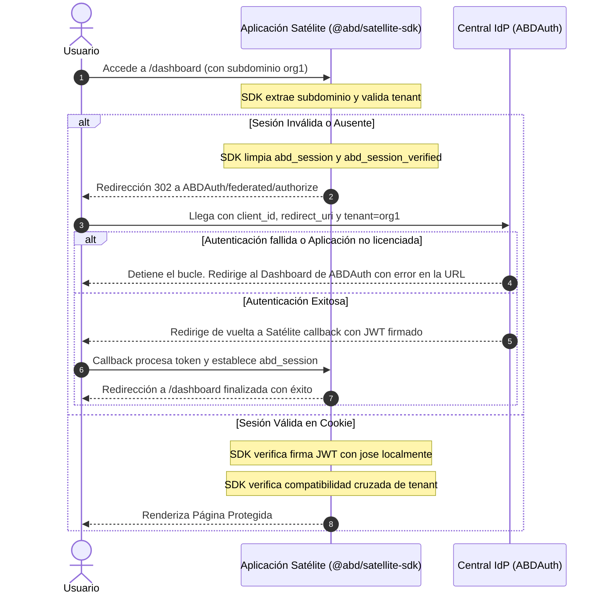

# 🗺️ Plan de Implementación: SDK Centralizado de Satélites (`@abd/satellite-sdk`)

Este documento presenta la propuesta de diseño y el plan de implementación para la creación de `@abd/satellite-sdk`, una biblioteca unificada y empaquetada que encapsula toda la lógica de seguridad federada, control de acceso multi-tenant, mitigación de bucles en SSO e inyección estética para las aplicaciones satélite de la Suite ABD.

---

## 🎯 Objetivos del SDK
1. **Reducción de Tiempo de Integración (DX)**: Permitir que cualquier nueva aplicación satélite sea integrada al ecosistema de SSO y control de accesos en menos de 5 minutos.
2. **Cero Duplicación de Código**: Evitar la copia de middleware (`proxy.ts`), verificadores criptográficos (`token-verifier.ts`), resolvedores de subdominio y clientes HTTP de sesión.
3. **Robustez y Seguridad Homogénea**: Garantizar que todas las aplicaciones satélite ejecuten con total rigurosidad la validación cruzada de organizaciones (Cross-Tenant Security) y la prevención de bucles infinitos.
4. **Cumplimiento y Auditoría Unificada**: Facilitar la estandarización de eventos de auditoría y asegurar la compatibilidad transparente con `ABDLogs`.

---

## 📂 Estructura del Paquete

El SDK se estructurará como un paquete híbrido (CommonJS + ESM) escrito en TypeScript, compilado a través de `tsup` y publicado localmente o mediante registro de NPM.

```text
@abd/satellite-sdk/
├── package.json
├── tsconfig.json
├── tsup.config.ts
├── src/
│   ├── index.ts                # Punto de entrada de exportaciones públicas
│   ├── middleware.ts           # Middleware global withIndustrialAuth
│   ├── session.ts              # Resolvedor de sesión en servidor y guardias de rol
│   ├── client/
│   │   └── useSession.tsx      # React Hook useSession para Client Components
│   ├── styles/
│   │   └── tailwind.preset.js  # Configuración común de Tailwind CSS v4 para la Suite
│   ├── utils/
│   │   ├── crypto.ts           # Verificación de JWT usando 'jose'
│   │   ├── subdomain.ts        # Extracción y resolución de subdominios
│   │   └── loop-guard.ts       # Detección y limpieza de bucles de redirección
│   └── types.ts                # Definiciones de tipos estrictos compartidos
```

---

## 🛠️ Especificación Técnica de las APIs Principales

### 1. Middleware Unificado: `withIndustrialAuth(options)`
Función de orden superior que intercepta todas las peticiones entrantes de la aplicación Next.js y gestiona el ciclo completo del proxy federado.

```typescript
// Firma de la API
export function withIndustrialAuth(options: IndustrialAuthOptions): (request: NextRequest) => Promise<NextResponse>;

interface IndustrialAuthOptions {
  clientId: string;               // ID de cliente registrado en el IdP
  appId: string;                  // Slug único de la app (ej: 'quiz', 'gobernanza')
  publicPaths?: string[];         // Rutas públicas que no requieren autenticación
  intlMiddleware?: (req: NextRequest) => Promise<NextResponse> | NextResponse; // Middleware de i18n opcional
}
```

#### Flujo Lógico Interno del Middleware:
1. **Filtrado de Assets**: Ignorar de forma segura peticiones de recursos estáticos, imágenes y rutas internas de Next.js (`/_next`, `/api/`).
2. **Resolución de Subdominio de Tenant**: 
   * Extraer el subdominio de la cabecera `host`.
   * Realizar una llamada backchannel rápida al endpoint `/api/auth/tenant/info?subdomain=xyz` del IdP para verificar el estado de la organización. Si está inactiva o no existe, redirigir a `/logout-success?error=tenant_not_found`.
3. **Decodificación y Firma Criptográfica**: 
   * Leer la cookie `abd_session`.
   * Validar su integridad con la clave secreta `AUTH_JWT_SECRET` mediante la librería `jose`.
4. **Verificación Anti-Contaminación Cruzada (Cross-Tenant Guard)**: 
   * Comprobar que el `tenantId` embebido en el JWT coincide exactamente con el `tenantId` de la organización resuelta a partir del subdominio.
5. **Mitigación del Desfase de Expiración (Session Expiry Desync)**:
   * Si la cookie de inmunidad `abd_session_verified` no está presente, llamar al endpoint `/api/auth/session/verify` del IdP central para garantizar que la sesión no haya sido revocada o el usuario suspendido.
   * Si la respuesta es exitosa, conceder una inmunidad de red de 60 segundos guardando la cookie `abd_session_verified`.
6. **Bypass de Rutas Públicas**: Si el usuario no está autenticado pero la ruta actual es pública (ej: `/`), permitir el paso al middleware i18n.
7. **Redirección Segura y Prevención de Bucles**:
   * Si el usuario no está autenticado, construir la URL al IdP `/api/auth/federated/authorize`.
   * Adjuntar `client_id`, `redirect_uri` (`/api/auth/federated/callback`), `state` (con la ruta actual) y el `tenantId` resuelto.
   * **Limpieza preventiva**: Limpiar inmediatamente las cookies locales `abd_session` y `abd_session_verified` en la respuesta de redirección para cortar ciclos infinitos si la autenticación falla recurrentemente en el IdP.

---

### 2. Gestión de Sesión en el Servidor: `getIndustrialSession()` e `ensureIndustrialAccess(requiredRole)`
Métodos diseñados para su uso en Server Layouts, Server Pages, Server Actions y APIs internas.

```typescript
export interface FederatedSession {
  authenticated: boolean;
  user?: {
    id: string;
    email: string;
    name: string;
    surname: string;
    role: string;
    tenantId: string;
    dbPrefix: string;
    isolationStrategy: string;
    permissions?: string[];
  };
}

/**
 * Obtiene la sesión desencriptando y verificando el JWT de la cookie abd_session
 */
export async function getIndustrialSession(): Promise<FederatedSession>;

/**
 * Lanza una excepción controlada (Unauthorized/Forbidden) si la sesión es inválida
 * o si no cumple con el rol requerido (respetando la inmunidad del SUPER_ADMIN)
 */
export async function ensureIndustrialAccess(requiredRole?: string): Promise<FederatedSession['user']>;
```

---

### 3. Hook de Cliente: `useSession()`
React Context Provider y hook personalizado para componentes del lado del cliente, ofreciendo acceso inmediato a los datos del perfil y facilitando la reactividad en la UI.

```typescript
'use client';

import React, { createContext, useContext } from 'react';
import { FederatedSession } from '../types';

const SessionContext = createContext<FederatedSession>({ authenticated: false });

export const SessionProvider: React.FC<{ value: FederatedSession; children: React.ReactNode }> = ({ value, children }) => {
  return <SessionContext.Provider value={value}>{children}</SessionContext.Provider>;
};

export function useSession() {
  const context = useContext(SessionContext);
  if (!context) {
    throw new Error('useSession must be used within a SessionProvider');
  }
  return context;
}
```

---

## 🎨 Integración Estética y Tailwind CSS Preset

Para asegurar que los satélites cumplan automáticamente con el estándar visual **Tech-Noir / Uncodixfy** sin necesidad de replicar la configuración de temas, el SDK incluye un Preset de Tailwind CSS.

### Archivo `tailwind.preset.js`:
```javascript
module.exports = {
  theme: {
    extend: {
      colors: {
        background: 'hsl(var(--background))',
        foreground: 'hsl(var(--foreground))',
        primary: {
          DEFAULT: 'hsl(var(--primary))',
          foreground: 'hsl(var(--primary-foreground))',
        },
        card: {
          DEFAULT: 'hsl(var(--card))',
          foreground: 'hsl(var(--card-foreground))',
        },
        border: 'hsl(var(--border))',
        destructive: {
          DEFAULT: 'hsl(var(--destructive))',
          foreground: 'hsl(var(--destructive-foreground))',
        }
      },
      borderRadius: {
        xl: 'calc(var(--radius) + 1px)',
        lg: 'var(--radius)',
        md: 'calc(var(--radius) - 1px)',
        sm: 'calc(var(--radius) - 2px)',
      }
    }
  }
};
```
*   **Modo de uso en satélites**: En el `tailwind.config.js` del satélite, simplemente se añade `presets: [require('@abd/satellite-sdk/tailwind.preset')]`.

---

## 🚀 Flujo de Redirección y Prevención de Bucles


---

## 📋 Guía de Integración Paso a Paso (Para un nuevo Satélite)

### Paso 1: Instalación de Dependencias
```bash
pnpm add @abd/satellite-sdk
```

### Paso 2: Configuración de Variables de Entorno (`.env`)
```env
NEXT_PUBLIC_APP_ID="nuevo-satelite"
AUTH_CLIENT_ID="nuevo-satelite-client-id"
AUTH_JWT_SECRET="el-secreto-compartido-de-la-suite"
AUTH_PROVIDER_URL="https://auth.tudominio.com"
```

### Paso 3: Crear el Middleware (`middleware.ts`)
```typescript
import { NextRequest } from 'next/server';
import { withIndustrialAuth } from '@abd/satellite-sdk/middleware';
import createMiddleware from 'next-intl/middleware';
import { routing } from './i18n/routing';

const intlMiddleware = createMiddleware(routing);

export default withIndustrialAuth({
  clientId: process.env.AUTH_CLIENT_ID || 'nuevo-satelite-client-id',
  appId: process.env.NEXT_PUBLIC_APP_ID || 'nuevo-satelite',
  publicPaths: ['/', '/es', '/en', '/logout-success'],
  intlMiddleware,
});

export const config = {
  matcher: ['/((?!api|_next/static|_next/image|.*\\.svg$).*)'],
};
```

### Paso 4: Consumir la Sesión en Layouts de Servidor
```typescript
import { getIndustrialSession } from '@abd/satellite-sdk';

export default async function Layout({ children }) {
  const session = await getIndustrialSession();
  
  return (
    <div>
      <Sidebar session={session} />
      {children}
    </div>
  );
}
```
