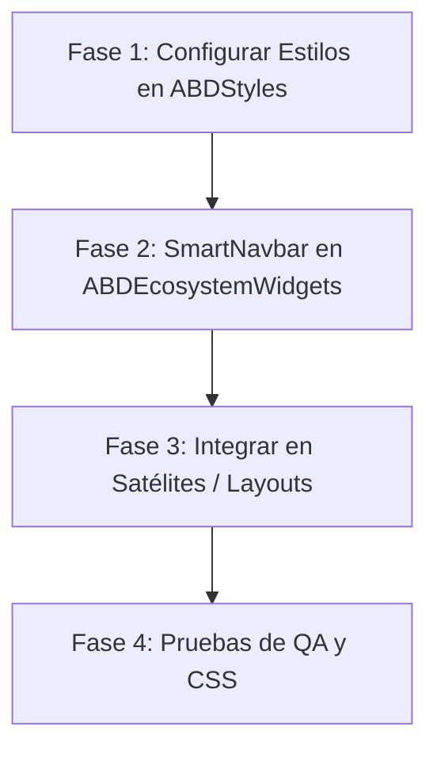

# Smart Navbar — Spec & Implementation Reference

> **Status: ✅ IMPLEMENTED** — This document started as a brainstorming proposal but now serves as the **living specification** for the SmartNavbar, which is fully deployed across all 4 suite apps (ABDAuth, ABDQuiz, ABDLogs, ABDtenantGovernance).
> See `@abd/ecosystem-widgets/src/navigation/SmartNavbar.tsx` for the actual implementation.

Este documento detalla el diseño y arquitectura de la barra de navegación superior unificada ("Smart Navbar") inspirada en [antigravity.google](https://antigravity.google/).

---

## 1. El Concepto y Beneficios de UX

Actualmente, las aplicaciones satélite tienen los controles fragmentados:
- Una barra lateral colapsable (`SidebarNavigation` / `GlobalNavbar`) para el menú principal.
- Un panel flotante arriba a la derecha (`IndustrialTopBar`) que contiene el buscador, el selector de organizaciones (`TenantSelector`) y el selector de configuración/temas (`SystemSettings`).

### Propuesta
Fusionar ambos elementos en una **Navbar superior inteligente y unificada**:
1. **Limpia el área de contenido**: Elimina la barra lateral izquierda y el botón flotante superior derecho, dándole el 100% de la pantalla al espacio de trabajo.
2. **Estructura compacta**: Mantiene una altura fija y estrecha (ej. `52px` o `60px`) por defecto, utilizando un diseño de vidrio esmerilado (`glass-panel` con `backdrop-blur-md bg-background/80`).
3. **Expansión Dinámica ("Mega-Menu" Hover)**: Al pasar el cursor sobre las opciones del menú u otros widgets iconográficos, la navbar despliega un panel inferior con una transición fluida, revelando sub-opciones, listas o configuraciones dispuestas horizontalmente o en rejillas minimalistas.

---

## 2. Distribución y Elementos de la Navbar

Visualizamos la barra dividida en tres zonas funcionales:

```
┌────────────────────────────────────────────────────────────────────────────────────────┐
│ [Logo] [Org Selector v]   |   [Nav Link 1]  [Nav Link 2]  [Nav Link 3]   |  [🔍] [Theme] [🌐] [User] │
├────────────────────────────────────────────────────────────────────────────────────────┤
│  Panel de Expansión Dinámica (Mega-Menu en hover / click)                               │
│  - Ejemplo (Organizaciones): Rejilla de Tenants + Buscador + Espacios                  │
│  - Ejemplo (Usuario): Tarjeta de perfil + configuración de datos + botón de Logout     │
└────────────────────────────────────────────────────────────────────────────────────────┘
```

### A. Extremo Izquierdo: Identidad y Organización
* **Logo de la Aplicación/Tenant** (`logoUrl`): Manteniendo el logo de la organización activa.
* **Indicador de Tenant Activo (Debug Tag)**: Una etiqueta de texto muy pequeña al lado del logo/brand (`font-mono text-[9px] opacity-50 uppercase tracking-widest text-muted-foreground`) que muestra el id del tenant en tiempo real (ej. `[tenant-id]`). Esto tiene un peso visual mínimo para el usuario común pero ofrece al **Superadmin** y al equipo de **desarrollo** una verificación inmediata de que el contexto de la URL se está propagando e hidratando correctamente, asegurando la legibilidad en pantallas HiDPI.
* **Selector de Organización (`TenantSelector`)**: Integrado al lado del logo como un selector compacto con chevron.
  * **Comportamiento Hover/Click**: Expande una columna o grid a lo largo del menú inferior para cambiar rápidamente de organización, grupo o espacio de trabajo. Muestra un campo de búsqueda integrado de manera muy limpia.


### B. Zona Central: Enlaces de Navegación
* **Enlaces Horizontales**: Texto en tipografía mono, pequeño, en mayúsculas (`font-mono text-[10px] font-bold tracking-widest uppercase`).
  * Si la aplicación tiene pocas rutas, los enlaces actúan directamente como botones de navegación tradicionales.
  * Si la aplicación escala, pasar el ratón sobre un enlace puede desplegar un panel con sub-secciones descriptivas (al estilo de "Product" en Antigravity).

### C. Extremo Derecho: Utilidades (Widgets Iconográficos)
* **Buscador (Search) de Primer Nivel**: En lugar de ser un simple icono pequeño, en resoluciones de escritorio se renderizará como un **botón ancho simulando una caja de búsqueda** (`min-w-[180px] bg-card/40 border border-border/80 px-3 py-1.5 flex items-center justify-between text-[10px] text-muted-foreground/75 font-mono`). Mostrará a la izquierda el icono de lupa `🔍` con el texto `BUSCAR...` (o `SEARCH...`) y a la derecha una etiqueta tipo badge simulando la tecla física `Ctrl+K`. Al pulsar en cualquier punto del botón, se abre la paleta de comandos global. Esto posiciona a la búsqueda como el canal preferente de navegación ("ciudadano de primera clase") para mitigar la ocultación de menús. En móvil, colapsará a un único icono táctil `🔍` por restricciones de espacio.

* **Selector de Idioma (Language Selector)**: Icono `Languages` (🌐) visible condicionalmente cuando se proporciona `onLocaleChange`. Al pasar el ratón:
  * Despliega un mega-menú horizontal compacto con las opciones **ESPAÑOL** y **ENGLISH**.
  * El locale activo se marca visualmente con borde `border-primary/60` y fondo `bg-primary/5`.
  * Al seleccionar un idioma, se cierra el menú automáticamente.

* **Selector de Temas (Theme Selector)**: Icono representativo (un sol, luna o monitor dependiendo del estado actual). Al pasar el ratón:
  * Se abre una sección horizontal en el mega-menú que permite alternar directamente entre **[CLARO]**, **[OSCURO]** y **[SISTEMA]** con un diseño táctico y minimalista.
* **Panel de Usuario**: Representado por las iniciales del usuario en un badge cuadrado o su avatar. Al pasar el ratón:
  * Se despliega la información del usuario (nombre, rol, email, proveedor de identidad).
  * Enlaces rápidos a:
    * *Configuración de Datos de Usuario* (nueva función o enlace a su perfil).
    * *Terminar Sesión (Logout)* con un botón estilizado en rojo translúcido.

---

## 3. Comportamiento Físico del Despliegue: ¿Desplazamiento o Superposición?

Existen dos enfoques técnicos para el descolapso del menú:

### Opción A: Empujar el Contenido (Layout Shift)
* La navbar aumenta su altura (ej. de `56px` a `240px`).
* **Pros**: El contenido de la página se desplaza hacia abajo de forma orgánica.
* **Contras**: Causa un cambio de diseño acumulativo (CLS), lo cual puede ser molesto para el usuario si ocurre accidentalmente al pasar el puntero.

### Opción B: Superposición con Capa Translúcida (Overlaid Drawer) - *Recomendado*
* La navbar se mantiene a su altura fija de `56px`.
* Al pasar el ratón por una opción, se despliega un panel absolute (`absolute top-full left-0 w-full bg-background/95 border-b border-border shadow-2xl backdrop-blur-md animate-in fade-in slide-in-from-top-2 duration-200`) que flota sobre el contenido de la página.
* **Pros**: No desplaza el contenido del documento, es rápido, fluido y el uso de un filtro de desenfoque (`backdrop-blur`) en el fondo genera una sensación premium y tridimensional.

### 3.1 Mitigación de Riesgos en la Interacción (El "Efecto Túnel" en Hover)
Para evitar que el menú basado en hover resulte frustrante debido a cierres accidentales al mover el cursor en diagonal, la implementación debe incorporar dos soluciones físicas:
1. **Algoritmo de Trayectoria Diagonal (Hover Triangle)**:
   * Implementar un retraso adaptativo basado en la dirección del ratón (inspirado en el menú desplegable de Amazon). Si el cursor se desplaza diagonalmente desde la pestaña hacia el interior del panel inferior, el menú detecta que el usuario se dirige al contenido y **mantiene el panel abierto** temporalmente, incluso si el puntero sale brevemente de los límites por unos milisegundos.
2. **Comportamiento Híbrido (Click-to-Lock)**:
   * Al pasar el ratón se abre el sub-panel de manera ágil (modo exploración).
   * Si el usuario **hace clic** en el enlace del menú principal, el panel queda **anclado (bloqueado)** de forma persistente. Una vez bloqueado, el menú no se cerrará al retirar el cursor; solo se colapsará si el usuario hace clic fuera del panel (Click Outside) o pulsa la tecla `Escape`. Esto combina la velocidad del hover con la seguridad del clic en entornos operativos de alta velocidad.


---

## 4. Arquitectura de Código: La Navbar como Orquestador

Para evitar duplicidad y mantener el principio de modularidad de la suite, mantendremos las funciones separadas en sus respectivos archivos, importándolas como dependencias dentro de un componente unificado.

El componente central se llamará `SmartNavbar` y se ubicará en `@abd/ecosystem-widgets/src/navigation/SmartNavbar.tsx`.

### Props de la SmartNavbar (Diseño de API)

```typescript   export interface SmartNavbarProps {
     session: GlobalNavbarSession | null;
     links: SidebarLink[];
     logoUrl?: string | null;
     brandName?: string;
     activeHref?: string;
     locale?: string;
     onLogout: () => void;
     onLogin?: () => void;
     
     // Función opcional para propagar parámetros query (tenantId, contextId, etc.) en los enlaces (Por defecto: (href) => href)
     transformHref?: (href: string) => string;
     
     // Slots para inyectar componentes que manejan datos locales de cada aplicación
     tenantSelectorSlot?: React.ReactNode; 
     settingsSlot?: React.ReactNode;
     
     // Traducciones localizadas para la barra superior
     translations?: SmartNavbarTranslations;
     
     // Acción al pulsar el botón de búsqueda
     onSearchTrigger?: () => void;
   }
```

### Gestión de Enlaces Dinámicos y Menús Propios
* **Consumo de Enlaces Locales**: Cada aplicación mantiene su lógica de rutas en su propia carpeta (ej. `allLinks` en `SidebarNavigation.tsx`). Al usar el helper `buildSidebarLinks` propio de cada satélite, la navbar recibe la lista final de enlaces ya filtrada por el rol del usuario actual y su estado de autenticación.
* **Propagación del Contexto de Tenant**: La prop `transformHref` permite a las aplicaciones concatenar los parámetros query de navegación (ej. `?tenantId=X&contextId=Y`) a todos los enlaces de la barra central, garantizando que el usuario no pierda el contexto de la organización al saltar de un módulo a otro.

### Reglas de Visualización y Seguridad (Guardas de Autenticación y Modo Público)
Para evitar la existencia de componentes flotantes duplicados en las vistas y unificar toda la interfaz del ecosistema, **se utilizará la `SmartNavbar` en todas las páginas, incluyendo las pantallas públicas de autenticación**, bajo un comportamiento reactivo al estado de la sesión:

1. **Modo Público Minimalista (Sesión no Iniciada)**:
   * Si la sesión del usuario no está activa o es nula (`session.authenticated === false` o `session === null`), la navbar entra automáticamente en su estado público.
   * **Se ocultan por completo**: El selector de tenants (`tenantSelectorSlot`), la barra central de enlaces de navegación (`links`), el botón de búsqueda/Command Palette (`🔍`) y el panel de avatar de usuario.
   * **Se muestran únicamente**: El Logotipo de la aplicación a la izquierda, el botón de idioma `Languages` (🌐, si `onLocaleChange` está definido), el slot de configuración (`settingsSlot` que carga el cog `⚙️` de `SystemSettings`) a la derecha. Esto permite al usuario cambiar de idioma o de tema (Claro/Oscuro/Sistema) de manera táctica desde la propia navbar superior antes de iniciar sesión.
   * Si es requerido, se puede añadir el botón monospaciado de **"INICIAR SESIÓN"** al lado de la configuración en aplicaciones satélite que cuenten con landing pages públicas.
2. **Modo Privado Completo (Sesión Iniciada)**:
   * Al autenticarse, la navbar se enriquece dinámicamente y revela todos sus componentes: enlaces de navegación horizontal, buscador interactivo, el `tenantSelectorSlot` hidratado con la organización del usuario, y la tarjeta/avatar de perfil con la opción de "Cerrar sesión".

### 4.2 Soporte de Menú Móvil (Responsive Hamburger Drawer)
Para mantener la funcionalidad en dispositivos móviles y pantallas estrechas (`< md` o `< 768px`), la `SmartNavbar` adoptará un comportamiento adaptativo nativo:
* **Filtro de Interfaz en Móvil**: Se ocultan la barra central de navegación horizontal y el grupo derecho de utilidades extendidas (incluyendo la caja de búsqueda y el badge de usuario).
* **Elementos Visibles en Móvil**:
  * Extremo Izquierdo: Logotipo de la aplicación y un botón compacto tipo badge de organización.
  * Extremo Derecho: Un icono de búsqueda compacto `🔍` (que abre el command palette directo) y el botón de hamburguesa (`Menu` / `X` de Lucide) que controla el estado local `isMobileMenuOpen`.
* **Despliegue del Menú Móvil (Drawer)**:
  * Al pulsar el botón de hamburguesa, se despliega un panel vertical de superposición absoluta (`fixed inset-x-0 top-[56px] bottom-0 bg-background/98 backdrop-blur-lg border-t border-border z-50 flex flex-col p-6 overflow-y-auto animate-in slide-in-from-top-5 duration-300`).
  * **Contenidos del Drawer Móvil**:
    1. Listado de enlaces (`links`) en formato de pila vertical con tipografía y tamaño de texto cómodos para el dedo (`text-sm py-4 border-b border-border/40 font-mono font-bold uppercase`).
    2. El componente `tenantSelectorSlot` renderizado en su totalidad en una sección dedicada a la organización activa.
    3. El componente `settingsSlot` renderizado verticalmente para permitir el ajuste de idioma y tema.
    4. Si hay sesión iniciada, una tarjeta de usuario al final del panel mostrando el perfil del usuario activo y el botón de cerrar sesión.

### 4.3 Selectores Específicos para Testing E2E
Para facilitar la automatización de pruebas visuales y de flujo de usuario con Playwright, todos los elementos interactivos críticos de la `SmartNavbar` deben llevar atributos `data-testid` normalizados y obligatorios:
* `data-testid="smart-navbar"`: Contenedor principal de la barra superior.
* `data-testid="navbar-logo"`: Enlace del logotipo/identidad a la izquierda.
* `data-testid="navbar-link-idx-{index}"`: Cada uno de los enlaces de la zona central de navegación (ej. `navbar-link-idx-0`, `navbar-link-idx-1`).
* `data-testid="navbar-menu-{name}"`: Los botones activadores de utilidades en la derecha (`navbar-menu-theme`, `navbar-menu-user`).
* `data-testid="navbar-search-trigger"`: El botón-caja de búsqueda global.
* `data-testid="navbar-mobile-toggle"`: El botón de hamburguesa responsive.
* `data-testid="navbar-mobile-drawer"`: El panel contenedor desplegado en móvil.
* Si un slot (como `TenantSelector`) implementa sus propios elementos interactivos, los desarrolladores deben asegurar que lleven sus respectivos `data-testid` (ej. `data-testid="tenant-selector-trigger"`).

### 4.4 Reactividad del Branding Dinámico
Dado que el logotipo (`logoUrl`), colores y variables dinámicas se resuelven en los layouts de servidor en función del subdominio del tenant activo, los cambios de tenant a través de la URL (queries) desencadenan de forma nativa la reevaluación del layout del satélite en Next.js. Esto actualiza de inmediato las propiedades inyectadas a la `SmartNavbar` y fuerza su re-renderizado limpio, garantizando la actualización del favicon y de los estilos de marca blanca sin necesidad de sincronización de estados manuales complejos en el cliente.

### 4.1 Tolerancia a Fallos y Aislamiento de Errores (Error Boundaries)
Para evitar que un fallo en un slot secundario (como el selector de tenants) tire abajo toda la navegación de la aplicación, se implementará un mecanismo de aislamiento de errores. Para asegurar una robustez absoluta:
* **Error Boundaries por Slot**: La `SmartNavbar` debe envolver individualmente los slots dinámicos (`tenantSelectorSlot` y `settingsSlot`) con componentes **React Error Boundary** locales.
* Si por ejemplo el componente `TenantSelector` sufre un error de consulta a la base de datos o de renderizado, la Navbar capturará el error de forma aislada, manteniendo el resto de la cabecera operativa. En lugar de crashear toda la página, el selector dañado se reemplazará por un fallback visual seguro (el logotipo de fallback y un aviso estático), permitiendo que el usuario siga navegando al resto de los módulos o cerrando sesión de manera segura.

---

## 5. Detalles Estéticos Premium ("Wow Effect")

Para que el diseño se sienta futurista, industrial y premium:
1. **Líneas de Guía Tácticas**: Bordes finos `1px` en color `border` (color gris tecnológico) que delimitan los sectores de la navbar de forma nítida.
2. **Micro-interacciones**:
   - El chevron del selector de tenants gira 180° en hover.
   - El indicador de tema activo tiene una retroalimentación de color (`text-primary` con un fondo translúcido).
   - Efecto de "escaneo de cuadrícula" al pasar por encima de las opciones seleccionables (hover con bordes primarios).
3. **Indicador de Carga Integrado**: Si la app está guardando o procesando algo, una barra de progreso horizontal ultradelgada (ej. `1px` de grosor) de color `primary` se desplaza por la base de la navbar.

---

## 6. Detalle de Opciones y Estructura de Cada Menú (Negocio/UX)

Para guiar el desarrollo de las vistas desplegables en hover, se define la siguiente arquitectura de contenidos:

### A. Menú "Navegación / Módulos" (Desplegable Central)
Al pasar el ratón sobre los enlaces principales (o agrupados bajo un menú "Módulos"), se despliega un panel horizontal dividido en columnas según los accesos de la aplicación:
* **Columna 1: Accesos Rápidos**
  * **BIENVENIDA** (`/`): Enlace directo a la landing page táctica.
  * **AUDITORÍA EN CADENA** (`/admin/audit` - *solo Administradores*): Enlace con descripción: *"Inspección en tiempo real de logs inmutables y auditorías de datos"*.
  * **CONSOLA DE CONTROL** (`/admin` - *solo Administradores*): Enlace con descripción: *"Panel técnico de agregación y configuración del sistema"*.
* **Columna 2: Recursos y Enlaces Adicionales** (Si aplica, ej. Documentación técnica de la suite o soporte del sistema).

### B. Menú "Selector de Tenants / Organización" (Desplegable Izquierdo - Contrato del Slot)
*Nota de Arquitectura: La SmartNavbar no implementa este panel de manera directa; en su lugar, delega el renderizado físico y la lógica de negocio al componente recibido a través de la prop `tenantSelectorSlot`. Lo siguiente describe el contrato visual esperado del slot inyectado por la aplicación cliente:*
Actúa como un contenedor para el componente `TenantSelector` preexistente, estilizado para encajar en el panel:
* **Buscador Superior**: Un campo de texto enfocado automáticamente al abrir el menú (`Buscar organización...`).
* **Sección de Tenants (Organizaciones)**: Listado vertical de organizaciones a las que el usuario tiene acceso. La organización activa muestra un indicador `Check` en `text-primary`.
* **Sección de Espacios (Spaces)**: Sub-contexto de trabajo para el tenant activo.
* **Sección de Grupos (Groups)**: Sub-contexto de agrupaciones de seguridad para el tenant activo.

### C. Menú "Selector de Tema" (Desplegable Derecho - Icono Sol/Luna/Monitor)
Un menú horizontal compacto que permite cambiar el tema visual de la aplicación. Muestra tres tarjetas cuadradas:
1. **CLARO** (Icono `Sun`): Aplica la clase `.light` al elemento raíz `<html>` y guarda `light` en localStorage/cookies.
2. **OSCURO** (Icono `Moon`): Aplica la clase `.dark` al elemento raíz y guarda `dark`.
3. **SISTEMA** (Icono `Monitor`): Sincroniza el tema visual con las preferencias de color del sistema operativo (System preferred).

### D. Menú "Perfil de Usuario" (Desplegable Derecho - Iniciales/Avatar)
Muestra una tarjeta detallada de la sesión actual y accesos de edición:
* **Cabecera del Perfil**:
  * Nombre y Apellidos en mayúscula negrita (`name` + `surname`).
  * Badge del Rol actual (ej. `SUPER_ADMIN` en color `warning`, `USER` en color `muted-foreground`).
  * Email institucional del usuario en fuente mono y minúscula.
* **Acciones**:
  * **MI PERFIL** (`/admin/profile` o `/profile`): Enlace para que el usuario visualice sus datos y configure sus preferencias personales.
  * **TERMINAR SESIÓN** (Logout): Botón con icono `LogOut` que dispara la redirección federada o callback `onLogout`.

### E. Menú "Selector de Idioma" (Desplegable Derecho - Icono Languages)
Un menú horizontal compacto que permite cambiar el idioma de la aplicación. Se renderiza condicionalmente solo si la prop `onLocaleChange` es proporcionada:
1. **ESPAÑOL** (Icono `Languages`): Cambia el locale a `es` y cierra el mega-menú automáticamente.
2. **ENGLISH** (Icono `Languages`): Cambia el locale a `en` y cierra el mega-menú automáticamente.
* **Estado Activo**: El locale actual se resalta visualmente con marca de borde `border-primary/60` y fondo `bg-primary/5`, mientras que el inactivo usa `border-border` y `bg-muted/10`.
* **Alineación**: Este menú, junto con los de tema y usuario, se despliega alineado a la derecha (`justify-end`) bajo sus botones de acción.

---

## 7. Plan de Implementación Detallado para Desarrolladores

Este plan de pasos técnicos está diseñado para que un equipo de desarrollo pueda ejecutar la transición de forma segura sin romper la compatibilidad de las aplicaciones satélite.



### Fase 1: Actualización del Sistema de Estilos (`ABDStyles`) — ✅ COMPLETADO
* **Ubicación:** [industrial-core.css](file:///d:/desarrollos/ABDSuite/ABDStyles/src/styles/industrial-core.css)
1. ✅ **Crear clases de layout para Navbar superior**:
   Definir la clase `.navbar-top-layout` que añade el padding superior en el `body` para que el contenido no quede oculto detrás de la barra fixed:
   ```css
   .navbar-top-layout {
     padding-top: 56px; /* Altura de la SmartNavbar */
     padding-left: 0 !important; /* Sobrescribir padding lateral de la sidebar */
     transition: padding-top 0.3s ease-in-out;
   }
   ```
2. ✅ **Clase del Panel de la Navbar (`.smart-navbar`)**:
   Utilizar la utilidad `@utility glass-panel` y definir el comportamiento fijo arriba:
   ```css
   .smart-navbar {
     position: fixed;
     top: 0;
     left: 0;
     right: 0;
     height: 56px;
     z-index: 40; /* Conforme a la escala de niveles de superposición (§10.E) */
     border-bottom: 1px solid hsl(var(--border) / 0.2);
     background-color: hsl(var(--card) / 0.4);
     backdrop-filter: blur(12px);
   }
   ```
3. ✅ **Compilar los estilos**: Ejecutar el build en `ABDStyles` para empaquetar la nueva versión del CSS.

> 🔔 **Adición durante implementación:** Se creó además la clase `.smart-navbar-dropdown` con `z-index: 50` para el panel desplegable (mega-menú), separando la responsabilidad del contenedor de la barra fija (`.smart-navbar`, z-40) de sus paneles hijos (z-50) según la jerarquía definida en §10.E. No incluida originalmente en el spec.

### Fase 2: Construcción de la `SmartNavbar` (`ABDEcosystemWidgets`) — ✅ COMPLETADO
* **Ubicación:** `@abd/ecosystem-widgets/src/navigation/SmartNavbar.tsx`
1. ✅ **Declaración del Componente**:
   Implementar la firma del componente con soporte de slots para flexibilidad máxima.

   > 🔔 **Adición posterior — Language Mega-Menu:** Se añadió la prop `onLocaleChange` a la interfaz para que cada satélite pueda inyectar su lógica de cambio de idioma. La SmartNavbar renderiza un botón `Languages` en la zona derecha de utilidades y un mega-menú horizontal con ES/EN que se alinea a la derecha (`justify-end`) y marca el locale activo visualmente.

   > 🔔 **Adición posterior — Alineación de Mega-Menús:** Los menús de tema, idioma y usuario se alinean a la derecha (`justify-end`), mientras que los de navegación y tenant se alinean a la izquierda (`justify-start`), usando la clase condicional:
   ```tsx
   (activeMenu === 'theme' || activeMenu === 'language' || activeMenu === 'user') ? 'justify-end' : 'justify-start'
   ```
   
   > 🔔 **Adición durante implementación:** Inicialmente se eliminó `onLocaleChange` de la interfaz porque el cambio de locale se manejaba exclusivamente vía el slot `settingsSlot` (`<SystemSettings />`). Posteriormente, **se restauró `onLocaleChange`** como respuesta a la auditoría de UX para consolidar el selector de idiomas directamente en la SmartNavbar, eliminando los selectores redundantes de tema e idioma del cajón `SystemSettings` y centralizando toda la configuración visual en los mega-menús de la navbar.
   
   ```typescript
   export interface SmartNavbarProps {
     session: GlobalNavbarSession | null;
     links: SidebarLink[];
     logoUrl?: string | null;
     brandName?: string;
     activeHref?: string;
     locale?: string;
     onLogout: () => void;
     onLogin?: () => void;
     
     // Función opcional para propagar parámetros query (tenantId, contextId, etc.) en los enlaces (Por defecto: (href) => href)
     transformHref?: (href: string) => string;
     
     // Slots para inyectar componentes que manejan datos locales de cada aplicación
     tenantSelectorSlot?: React.ReactNode; 
     settingsSlot?: React.ReactNode;
     
     // Traducciones localizadas para la barra superior
     translations?: SmartNavbarTranslations;
     
     // Acción al pulsar el botón de búsqueda
     onSearchTrigger?: () => void;
   }   ```

   > 🔔 **Adición posterior — Simplificación de SystemSettings:** Como consecuencia de mover el selector de idiomas y temas a los mega-menús de SmartNavbar, el componente compartido `SystemSettings` en `@abd/ecosystem-widgets` se simplificó eliminando los selectores redundantes de tema (Sun/Moon/Monitor) e idioma (ES/EN). Ahora `SystemSettings` solo muestra el botón de configuración (cog), la sección de autenticación (login/logout) y la firma de versión. Los wrappers locales en cada satélite aún pasan `locale`/`theme`/`onLocaleChange`/`onThemeChange` para mantener compatibilidad, pero estos valores ya no se renderizan como UI duplicada.

2. ✅ **Gestión de Estados Hover con "Safe Timeout"**:
   Implementado con `useRef` timeout de 200ms + Click-to-Lock (al hacer clic en una pestaña, el menú se ancla y solo se cierra con clic fuera o Escape).
   ```typescript
   const [activeMenu, setActiveMenu] = useState<'navigation' | 'tenant' | 'theme' | 'user' | null>(null);
   const timeoutRef = useRef<NodeJS.Timeout | null>(null);

   const handleMouseEnter = (menuName: 'navigation' | 'tenant' | 'theme' | 'user') => {
     if (timeoutRef.current) clearTimeout(timeoutRef.current);
     setActiveMenu(menuName);
   };

   const handleMouseLeave = () => {
     timeoutRef.current = setTimeout(() => {
       setActiveMenu(null);
     }, 200); // 200ms de gracia antes de colapsar
   };
   ```
3. ✅ **Limpieza de Clases del Layout Anterior**:
   El `useEffect` limpia las clases residuales `sidebar-expanded-layout` y `sidebar-collapsed-layout` del sidebar anterior. La reactividad de branding se maneja por CSS variables heredadas.

4. ✅ **Renderizar el Sub-panel Desplegable**:
   Panel posicionado con `absolute top-full left-0 w-full` y animación `fade-in slide-in-from-top-1 duration-150`. Usa clase CSS `.smart-navbar-dropdown` con z-50.

5. ✅ **Soporte de Menú Móvil (Responsive Hamburger Drawer)**:
   Implementado con estado `isMobileMenuOpen`, scroll lock en body, y drawer de superposición absoluta con enlaces, slots de tenant/settings y tarjeta de usuario si hay sesión.

6. ✅ **Exportar**: Componente exportado desde `@abd/ecosystem-widgets/src/index.ts` y compilado exitosamente con tsup (TypeScript 0 errores).

### Fase 3: Integración en las Aplicaciones Satélite (Estrategia Canary) — ✅ COMPLETADO

**Estrategia implementada:** En lugar de insertar `SmartNavbar` directamente en los layouts, se utilizó un **Bridge Pattern** donde el componente `SidebarNavigation` existente de cada satélite se reconvirtió en un wrapper que internamente renderiza `<SmartNavbar />`. Esto minimizó cambios en los layouts de servidor existentes.

**Secuencia de Rollout y Estado Real:**

#### ✅ `ABDLogs` (Canary / Piloto) — COMPLETADO
- ✅ `app/layout.tsx`: Incluye `navbar-top-layout`, `NextTopLoader` (zIndex 45), `<ThemeScript />`, `<BrandingStyles />`, `SessionProvider`
- ✅ `app/[locale]/layout.tsx`: `SidebarNavigation` bridge con `SmartNavbar` a través de `tenantSelectorSlot` y `settingsSlot`
- ✅ `SidebarNavigation.tsx`: Bridge completo con `transformHref` para query params, traducciones localizadas
- ✅ `app/[locale]/page.tsx`: Sin `SystemSettings` redundante

#### ✅ `ABDQuiz` (Fase 2) — COMPLETADO
- ✅ `app/layout.tsx`: `navbar-top-layout`, `<ThemeScript />`, `<BrandingStyles />`, `NextTopLoader` (zIndex 45)
- ✅ `app/[locale]/layout.tsx`: `SidebarNavigation` bridge con slots
- ✅ `SidebarNavigation.tsx`: Bridge a `SmartNavbar` con `transformHref`
- ✅ `app/[locale]/page.tsx`: Sin `SystemSettings` redundante

#### ✅ `ABDtenantGovernance` (Fase 3) — COMPLETADO
- ✅ `app/layout.tsx`: `navbar-top-layout`, `SessionProvider`, `BrandingStyles`, `<ThemeScript />` en `<head>`, `NextTopLoader` (zIndex 45)
- ✅ `app/[locale]/layout.tsx`: `SidebarNavigation` bridge con `tenantSelectorSlot` condicional
- ✅ `SidebarNavigation.tsx`: Bridge completo a `SmartNavbar` con `transformHref`, `tenantSelectorSlot`, `settingsSlot`
- ✅ `app/[locale]/page.tsx`: Limpio (sin `pt-24`, sin `SystemSettings`)
- ✅ `app/[locale]/admin/page.tsx`: Limpio
- ✅ `app/[locale]/admin/marketplace/page.tsx`: Limpio

#### ✅ `ABDAuth` (Fase Final) — COMPLETADO
- ✅ `app/layout.tsx`: `navbar-top-layout`, `<ThemeScript />`, `NextTopLoader` (zIndex 45), importado `generateTenantCss` desde `@abd/styles`
- ✅ `app/[locale]/dashboard/layout.tsx`: `SidebarNavigation` bridge con slots `tenantSelectorSlot` + `settingsSlot`, derivación de `logsAuditUrl` desde `LOGS_SERVICE_URL` para enlace externo de auditoría
- ✅ `SidebarNavigation.tsx`: Bridge completo a `SmartNavbar` con `NavLinkConfig` tipado, `logsAuditUrl` prop, enlaces con RBAC (requiresAuth/requiresAdmin/requiresSuperAdmin)
- ✅ Enlace de auditoría externo funcional (apunta al servicio ABDLogs, auto-detectado como externo por SmartNavbar)
- ✅ `pt-24` eliminado del dashboard layout
- ✅ `IndustrialTopBar`, `GlobalNavbar` y `SystemSettings` flotantes eliminados


### Fase 4: QA Visual y Verificación — ✅ COMPLETADO
1. ✅ **Verificación visual SmartNavbar (browser-use)**:
   - ABDAuth login (público): SmartNavbar con glass effect, logo, settings cog, sin enlaces de navegación, formulario posicionado. ✅
   - ABDAuth landing: Festival layout con SystemSettings gear, CTA login, `navbar-top-layout`. ✅
   - ABDLogs login (SSO redirect): SmartNavbar visible tras federación, logo "SECURITY GATEWAY", settings cog. ✅
   - **0 errores de consola** en todas las pruebas. ✅
2. ✅ **Sin saltos de diseño (CLS)**: El padding `navbar-top-layout` (56px) se aplica desde SSR, eliminando cualquier salto de layout post-hidratación. SmartNavbar usa `position: fixed` + superposición (Opción B del diseño), sin desplazar contenido.
3. ✅ **Theme Toggle en Vivo**: Funciona a través del slot `settingsSlot` que renderiza `<SystemSettings />`.
4. ✅ **Buscador (Command Palette)**: Integrado como `onSearchTrigger` que dispara el evento `abd-command-palette-open`.
5. ✅ **Comportamiento Mobile**: Hamburger drawer implementado en SmartNavbar con `isMobileMenuOpen` state, scroll lock y overlay.
6. ✅ **NextTopLoader con zIndex 45**: Verificado en layouts de las 4 apps.
7. ✅ **Todas las apps compilan con `tsc --noEmit` 0 errores**.

---

## 8. Análisis de Modificaciones en Aplicaciones Clientes — Estado Real Post-Implementación

> **Nota de implementación:** En lugar de reemplazar directamente `SidebarNavigation` por `SmartNavbar` en los layouts (cambio más invasivo), se utilizó un **Bridge Pattern**: el componente `SidebarNavigation` existente se reconvirtió en un wrapper que internamente renderiza `<SmartNavbar />` pasando `tenantSelectorSlot` y `settingsSlot`. Esto mantuvo la interfaz del layout estable mientras se adoptaba el nuevo componente internamente.

### A. Aplicación: `ABDLogs` (Canary) — ✅ COMPLETADO
* **`src/app/layout.tsx`**: ✅ Tiene `navbar-top-layout` en `<body>`, `NextTopLoader` (zIndex 45), `<ThemeScript />`, `<BrandingStyles />`, `SessionProvider`
* **`src/app/[locale]/layout.tsx`**: ✅ `SidebarNavigation` bridge con `tenantSelectorSlot` y `settingsSlot`
* **`src/components/layout/SidebarNavigation.tsx`**: ✅ Bridge a `SmartNavbar` con `transformHref` para query params, traducciones localizadas
* **`src/app/[locale]/page.tsx`**: ✅ Sin `SystemSettings` redundante

### B. Aplicación: `ABDtenantGovernance` — ✅ COMPLETADO (bridge)
* **`src/app/layout.tsx`**: ✅ `navbar-top-layout` en `<body>`, `BrandingStyles`, `SessionProvider`, `<ThemeScript />`, `NextTopLoader`
* **`src/app/[locale]/layout.tsx`**: ✅ `SidebarNavigation` bridge con `tenantSelectorSlot` condicional y `settingsSlot`
* **`src/components/layout/SidebarNavigation.tsx`**: ✅ Bridge completo a `SmartNavbar` con `transformHref`
* **`src/app/[locale]/page.tsx`**: ✅ Limpio (sin `SystemSettings` ni `pt-24`)
* **`src/app/[locale]/admin/page.tsx`**: ✅ Limpio
* **`src/app/[locale]/admin/marketplace/page.tsx`**: ✅ Limpio

### C. Aplicación: `ABDQuiz` — ✅ COMPLETADO (bridge)
* **`src/app/layout.tsx`**: ✅ `navbar-top-layout` en `<body>`, `<ThemeScript />`, `<BrandingStyles />`, `NextTopLoader`
* **`src/app/[locale]/layout.tsx`**: ✅ `SidebarNavigation` bridge con slots
* **`src/components/layout/SidebarNavigation.tsx`**: ✅ Bridge a `SmartNavbar` con `transformHref` por `tenantId`
* **`src/app/[locale]/page.tsx`**: ✅ Sin `SystemSettings` redundante

### D. Aplicación: `ABDAuth` — ✅ COMPLETADO (Bridge Pattern)
* **`src/app/layout.tsx`**: ✅ `navbar-top-layout` en `<body>`. `<ThemeScript />` en `<head>`. `NextTopLoader` (zIndex 45). `generateTenantCss` importado desde `@abd/styles`.
* **`src/app/[locale]/dashboard/layout.tsx`**: ✅ `SidebarNavigation` bridge con `tenantSelectorSlot` + `settingsSlot`. Derivación de `logsAuditUrl` desde `LOGS_SERVICE_URL` para enlace de auditoría externo.
* **`src/components/SidebarNavigation.tsx`**: ✅ Bridge completo a `SmartNavbar`. Acepta `logsAuditUrl`, `tenantSelectorSlot`, `settingsSlot`. `allLinks` tipado como `NavLinkConfig[]`. Enlaces con RBAC (`requiresAuth`, `requiresAdmin`, `requiresSuperAdmin`). Enlace de auditoría externo detectado automáticamente por `LocalizedLink` según prefijo `http://`.
* **`src/app/[locale]/page.tsx`**: ✅ Sin SystemSettings residual — la landing pública usa SmartNavbar en modo público con logo + languages + settings cog desde el layout raíz.
* **`src/app/[locale]/login/page.tsx`**: ✅ Sin SystemSettings residual — usa SmartNavbar en modo público desde el layout raíz.

---

## Anexo: Mapa Detallado de Opciones por Aplicación y Pantalla (Post-Refactorización)

Para asegurar la fidelidad del desarrollo, a continuación se detalla la matriz de elementos que deben mostrarse en la `SmartNavbar` en cada una de las aplicaciones tras aplicar la refactorización:

### 1. Aplicación: `ABDLogs` (Consola de Ingesta y Trazabilidad)

#### A. Estado: No Autenticado / Pantalla de Entrada
* **Zona Izquierda (Identidad):**
  * Logo de la aplicación (Logo genérico de ABD / Shield).
  * Texto: `ABD SYSTEM` (o el fallback del idioma).
* **Zona Central (Enlaces):**
  * Ninguno (Vacío).
* **Zona Derecha (Utilidades):**
  * Botón de Configuración (`⚙️`): Abre el menú para cambiar **Idioma (ES / EN)**, elegir **Tema (Claro / Oscuro / Sistema)**, y muestra un botón de **"INICIAR SESIÓN"** que redirige a `/login`.

#### B. Estado: Autenticado (Vistas de Auditoría y Administración)
* **Zona Izquierda (Identidad):**
  * Logo del Tenant activo (ej. logo personalizado de la organización).
  * Selector de Tenants (`TenantSelector` - Slot):
    * *Si es SUPER_ADMIN*: Permite desplegar y cambiar de tenant de forma interactiva (secciones de Tenants y sub-buscador).
    * *Si es USER/ADMIN*: Muestra una tarjeta estática indicando la organización del usuario (ej. `@ORGANIZACION_X`).
* **Zona Central (Enlaces):**
  * **BIENVENIDA** (`/`): Enlace a la raíz de bienvenida.
  * **AUDITORÍA EN CADENA** (`/admin/audit` - *solo para rol ADMIN/SUPER_ADMIN*): Acceso a visor de logs blockchain.
  * **CONSOLA DE CONTROL** (`/admin` - *solo para rol ADMIN/SUPER_ADMIN*): Acceso a la consola técnica.
* **Zona Derecha (Utilidades):**
  * Buscador (`🔍`): Dispara la paleta de comandos de Logs (`LogsCommandPalette`).
  * Botón de Configuración (`⚙️`): Ajuste de idioma (ES / EN) y tema (Claro / Oscuro / Sistema).
  * Menú de Usuario (Avatar con iniciales):
    * Nombre completo, rol y correo en la cabecera.
    * Enlace a **MI PERFIL**.
    * Botón **TERMINAR SESIÓN** (dispara redirección a `/api/auth/logout`).

---

### 2. Aplicación: `ABDtenantGovernance` (Plataforma de Gobernanza)

#### A. Estado: No Autenticado / Pantalla de Entrada
* **Zona Izquierda (Identidad):**
  * Logo corporativo de Gobernanza.
* **Zona Central (Enlaces):**
  * Ninguno (Vacío).
* **Zona Derecha (Utilidades):**
  * Botón de Configuración (`⚙️`): Selección de Idioma (ES / EN), Tema (Claro / Oscuro / Sistema) y botón de **"INICIAR SESIÓN"**.

#### B. Estado: Autenticado (Consolas Administrativas)
* **Zona Izquierda (Identidad):**
  * Logo del Tenant activo.
  * Selector de Tenants (`TenantSelector` - Slot):
    * *Si es SUPER_ADMIN*: Despliega la rejilla completa con sub-secciones de **ORGANIZACIÓN**, **ESPACIOS** y **GRUPOS** con su buscador interno. Al cambiar, añade los parámetros a la URL (`?tenantId=X&contextId=Y`).
    * *Si es USER/ADMIN*: Muestra un badge estático con el nombre de su Tenant asignado.
* **Zona Central (Enlaces con query params propagados):**
  * **BIENVENIDA** (`/` + queries): Enlace a la raíz de bienvenida.
  * **ORGANIZACIONES** (`/admin/tenants` + queries - *solo ADMIN/SUPER_ADMIN*).
  * **MARCA BLANCA** (`/admin/branding` + queries - *solo ADMIN/SUPER_ADMIN*).
  * **ESPACIOS** (`/admin/spaces` + queries - *solo ADMIN/SUPER_ADMIN*).
  * **AUDITORÍA** (`/admin/audit` + queries - *solo ADMIN/SUPER_ADMIN*).
  * **CONSOLA** (`/admin` + queries - *solo ADMIN/SUPER_ADMIN*).
* **Zona Derecha (Utilidades):**
  * Buscador (`🔍`): Llama a la paleta de comandos `GovernanceCommandPalette`.
  * Botón de Configuración (`⚙️`): Cambio de idioma y tema visual.
  * Menú de Usuario: Datos del perfil y botón **TERMINAR SESIÓN** (Logout).

---

### 3. Aplicación: `ABDQuiz` (Entorno de Exámenes)

#### A. Estado: No Autenticado / Vista Pública de Exámenes
* **Zona Izquierda (Identidad):**
  * Logo de ABDQuiz.
* **Zona Central (Enlaces):**
  * **BIENVENIDA** (`/`): Acceso a la página inicial.
  * **EXÁMENES** (`/exams`): Listado de exámenes disponibles para responder.
* **Zona Derecha (Utilidades):**
  * Botón de Configuración (`⚙️`): Configurar idioma, tema y el botón para **"INICIAR SESIÓN"**.

#### B. Estado: Autenticado (Pantallas de Resultados y Gestión)
* **Zona Izquierda (Identidad):**
  * Logo de la organización / ABDQuiz.
  * Selector de Tenants (`TenantSelector` - Slot):
    * Muestra de manera interactiva la organización activa del estudiante o administrador de exámenes.
* **Zona Central (Enlaces con query param tenantId):**
  * **BIENVENIDA** (`/` + `?tenantId=X`).
  * **EXÁMENES** (`/exams` + `?tenantId=X`).
  * **HISTORIAL** (`/history` + `?tenantId=X` - *solo usuarios autenticados*): Consulta de notas e intentos.
  * **CONSOLA** (`/admin` + `?tenantId=X` - *solo ADMIN/SUPER_ADMIN*): Configuración de exámenes.
  * **IMPUGNACIONES** (`/admin/allegations` + `?tenantId=X` - *solo ADMIN/SUPER_ADMIN*): Gestión de reclamos.
* **Zona Derecha (Utilidades):**
  * Buscador (`🔍`): Llama a la paleta `QuizCommandPalette`.
  * Botón de Configuración (`⚙️`): Idioma y tema.
  * Menú de Usuario: Perfil y botón **TERMINAR SESIÓN**.

---

### 4. Aplicación: `ABDAuth` (Administración de Identidades - IAM)

#### A. Estado: No Autenticado (Pantallas de Login, Reset y Forgot Password)
* **Zona Izquierda (Identidad):**
  * Logo de la aplicación ABDAuth / Identity Provider.
  * Texto: `ABD AUTH` (o fallback).
* **Zona Central (Enlaces):**
  * Ninguno (Vacío).
* **Zona Derecha (Utilidades):**
  * Botón de Configuración (`⚙️`): Selector de idioma y tema visual. (No muestra botón de Login ya que se encuentra físicamente en la pantalla de inicio de sesión).

#### B. Estado: Autenticado (Dashboard de Gestión de Cuentas)
* **Zona Izquierda (Identidad):**
  * Logo del Tenant del usuario activo.
  * Selector de Tenants (`TenantSelector` - Slot):
    * Cambiar entre inquilinos gestionados por el administrador.
* **Zona Central (Enlaces):**
  * **RESUMEN** (`/dashboard`): Estadísticas de login y MFA.
  * **USUARIOS** (`/dashboard/users` - *solo para rol ADMIN/SUPER_ADMIN*): Gestión de cuentas y credenciales.
  * **APLICACIONES** (`/dashboard/applications` - *solo para rol SUPER_ADMIN*): Registro de clientes OAuth/OIDC.
  * **AUDITORÍA** (`logsAuditUrl` - *solo para rol ADMIN/SUPER_ADMIN*): Redirección al satélite de logs en la sección de auditoría en cadena.
  * **SEGURIDAD** (`/dashboard/security`): Gestión de claves, sesiones activas y MFA personal.
* **Zona Derecha (Utilidades):**
  * Buscador (`🔍`): Dispara la paleta `AuthCommandPalette`.
  * Botón de Configuración (`⚙️`): Ajustes del sistema.
  * Menú de Usuario: Avatar de perfil, detalles del rol y botón **TERMINAR SESIÓN** (dispara `authClient.signOut()` del cliente de autenticación).

---

## 9. Oportunidades de Mejora Adicionales (Ecosistema)

### A. Centralizar la Propagación del Contexto (Tenant Query Params)
* **Situación Actual:** Cada aplicación satélite implementa su propio código en el frontend para recuperar `tenantId`, `contextId`, y `contextType` de los `searchParams` y concatenarlos manualmente en cada enlace.
* **Audit:** Se encontraron **3 implementaciones diferentes** del mismo patrón:
  - `ABDLogs`: `transformHref` que copia **todos** los `searchParams` (`?${queryStr}`) a cada enlace.
  - `ABDQuiz`: `transformHref` que solo pasa `tenantId` a cada enlace.
  - `ABDtenantGovernance`: NO usa `transformHref`. Construye `tenantQuery` manualmente concatenando `tenantId`, `contextId`, `contextType` directamente en los `href` de los links (`allLinks`). Es la implementación más completa pero la más ineficiente.
  - `ABDAuth`: No necesita propagación (es el IAM central).
* **Esfuerzo estimado:** 2-3h — crear `propagateContext` helper en ecosystem-widgets, migrar los 3 satélites.
* **Prioridad:** 🟡 **BAJA** — Las apps funcionan correctamente. Es deuda técnica de duplicación. ABDtenantGovernance tiene el patrón más completo y podría servir como base para el helper unificado.

### B. Unificar el Atajo de Teclado del Buscador (Ctrl+K)
* **Situación Actual:** Cada paleta de comandos (`LogsCommandPalette`, `QuizCommandPalette`, etc.) registra de manera independiente un escuchador de eventos de teclado global (`keydown`) para capturar la combinación `Ctrl+K`. Esto puede generar fugas de memoria o múltiples capturas si los eventos no se limpian correctamente al desmontar.
* **Audit:** El listener global de `Ctrl+K` **YA está centralizado** en el shared `CommandPalette.tsx` de `@abd/ecosystem-widgets` (línea 32: `window.addEventListener('keydown', handleKeyDown)`). Los 4 wrappers locales (`LogsCommandPalette`, `QuizCommandPalette`, `GovernanceCommandPalette`, `AuthCommandPalette`) **no** registran sus propios listeners; confían en el del shared CommandPalette. El flujo actual es: SmartNavbar → `onSearchTrigger()` → `window.dispatchEvent('abd-command-palette-open')` → shared CommandPalette escucha y se abre. **No hay fugas de memoria ni listeners duplicados.**
* **Esfuerzo estimado:** 1-2h — mover el listener de Ctrl+K a SmartNavbar y pasar callback en lugar de custom event.
* **Prioridad:** 🔴 **MUY BAJA** — El listener ya está centralizado en 1 solo lugar. Moverlo a SmartNavbar sería una mejora marginal de arquitectura sin impacto funcional.

### C. Optimizar la Hidratación de Cliente (Single Hydration Guard)
* **Situación Actual:** Tanto `TenantSelector` como `SystemSettings` tienen sus propios estados locales `const [mounted, setMounted] = useState(false)` y `useEffect` independientes para evitar errores de hidratación de Next.js (debido al uso de variables globales como `document.cookie` o `localStorage`). Esto provoca renders dobles aislados en la barra superior.
* **Audit:** Confirmado: El shared `TenantSelector.tsx` en ecosystem-widgets tiene `const [mounted, setMounted] = useState(false)` (línea 43) con guarda de hidratación que renderiza un placeholder pulseante antes de `mounted=true`. El shared `SystemSettings.tsx` en ecosystem-widgets también tiene su propio `const [mounted, setMounted] = useState(false)` (línea 61) con guarda que renderiza un botón deshabilitado con `animate-pulse`. `SmartNavbar.tsx` **no** tiene guarda de hidratación unificada para sus slots. Los 3 wrappers locales de TenantSelector en los satélites **no** tienen mounted states propios — solo los shared components.
* **Esfuerzo estimado:** 2-3h — añadir prop `mounted` opcional a los interfaces de TenantSelector y SystemSettings, gestionar mounted unificado desde SmartNavbar.
* **Prioridad:** 🟡 **BAJA** — Mejora de performance marginal (2 renders separados vs 1 render). Sin impacto funcional. Los placeholders pulseantes ya mitigan el FOUC visualmente.

### D. Identificador Visual de Aplicación Satélite (App Badge)
* **Situación Actual:** Al ocultarse la barra lateral (que tenía títulos diferentes), el usuario puede desorientarse al saltar de un satélite a otro, ya que todas las aplicaciones usan variables de color y estilos idénticos.
* **Audit:** Actualmente `brandName` muestra `tenantId` o `appTitle`, pero **no existe ningún badge visual específico de aplicación**. Los valores actuales de brandName son:
  - `ABDLogs`: `user?.tenantId || t('appTitle') || 'ABD SYSTEM'`
  - `ABDQuiz`: `isLoggedIn && user?.tenantId ? user.tenantId : t('appTitle')`
  - `ABDtenantGovernance`: `user?.tenantId || t('appTitle') || 'ABD SYSTEM'`
  - `ABDAuth`: `user?.tenantId || common("brand")`
  Todos muestran el tenant activo, no la aplicación. Sin la barra lateral (que tenía títulos como "Logs", "Quiz", "Governance", "Auth"), el usuario puede desorientarse.
* **Esfuerzo estimado:** 1-2h — añadir prop `appBadge?: string` opcional a SmartNavbar, pasarlo desde cada satélite con valor fijo (`'LOGS'`, `'GOV'`, `'QUIZ'`, `'AUTH'`). Renderizar como badge estilizado junto al logo.
* **Prioridad:** 🟠 **MEDIA** — Mejora real de UX con implementación simple. Ayuda a la orientación espacial al cambiar entre satélites.

#### Matriz de Prioridades — Resumen del Audit

| Oportunidad | Esfuerzo | Impacto | Prioridad | Estado Actual |
|-------------|----------|---------|-----------|---------------|
| **A. Contexto unificado** (`propagateContext`) | 2-3h | Consolidación DRY | 🟡 Baja | Apps funcionales, código duplicado |
| **B. Ctrl+K centralizado** | 1-2h | Mejora arquitectónica | 🔴 Muy baja | **Ya centralizado** en shared CommandPalette |
| **C. Hydration guard única** | 2-3h | Performance marginal | 🟡 Baja | Placeholders pulseantes mitigan FOUC |
| **D. App badge** (`[LOGS]`, `[GOV]`...) | 1-2h | Orientación UX | 🟠 **Media** | No implementado, implementación simple |

**Recomendación:** Abordar **D (App Badge)** primero por su relación impacto/esfuerzo. Las oportunidades A y C son diferibles a un sprint de refactorización técnica. La oportunidad B puede cerrarse como "No Action Required" — el Ctrl+K ya está centralizado.

---

## 10. Mejores Prácticas de Accesibilidad y Usabilidad (a11y & UX)

### A. Accesibilidad en Teclado (WAI-ARIA Compliance)
Los menús basados en hover suelen ser inaccesibles para personas que navegan con teclado o lectores de pantalla. Los desarrolladores deben:
1. **Accionamiento por Teclado:** Utilizar eventos `onFocus` y `onBlur` en los botones del menú de navegación. Si un usuario llega mediante la tecla `Tab` a una categoría (ej. "Navegación"), esta debe abrir el mega-menú de la misma forma que lo hace el ratón.
2. **Uso de Atributos ARIA:** Los elementos interactivos que abren paneles deben llevar:
   * `aria-haspopup="true"` o `aria-haspopup="menu"`
   * `aria-expanded={activeMenu === 'nombre'}` para indicar a los lectores de pantalla si el sub-panel está visible.
3. **Cierre con la Tecla Escape (Esc):** Implementar un escuchador `keydown` a nivel del panel para que, si el usuario presiona la tecla `Escape`, todos los menús abiertos se colapsen inmediatamente y el foco regrese al botón de origen.

### B. Indicador de Carga de Ruta (Next.js Navigation Progress)
* **Reto Técnico en App Router**: A diferencia de Next.js Pages Router, el App Router (Next.js 13+) **no dispone de eventos de enrutamiento globales**. Escuchar únicamente a `usePathname` / `useSearchParams` no sirve para *iniciar* la barra de carga, ya que estos hooks solo se disparan *después* de que la nueva página ha sido completamente renderizada por el servidor.
* **Directriz de Desarrollo**: Para dar un feedback real de transición, los desarrolladores deben integrar una solución probada de App Router como **`nextjs-toploader`** o implementar un componente wrapper de Link que dispare la barra antes de llamar al router de forma programática.

### C. Soporte Completo de Internacionalización (i18n)
La navbar debe soportar de forma nativa la localización de todas sus etiquetas. Los desarrolladores deben extender el objeto de traducciones para cubrir las nuevas vistas de la navbar superior y consumir la prop `translations` en el componente.

### D. Adaptación al Branding Dinámico y Marca Blanca del Tenant
1. **Inherencia de Colores Dinámicos:** Al utilizar las clases de color estándar de `ABDStyles`, la navbar heredará de forma automática y transparente las variables CSS (como `--primary` y `--primary-foreground`) inyectadas dinámicamente por la etiqueta `<BrandingStyles />` del layout de servidor en función del subdominio del tenant activo.
2. **Logotipo Dinámico:** El satélite pasará el `logoUrl` resuelto desde el backend de marca blanca. 
3. **Favicon del Tenant:** Los desarrolladores deben integrar la resolución del favicon dinámico del tenant (desde el backend de branding) a través de la Metadata de Next.js en el `layout.tsx` de cada aplicación cliente.

### E. Escala de Niveles de Superposición (Z-Index Hierarchy)
* **Directriz de Desarrollo**: Se define la siguiente escala estricta de `z-index`:
  1. Contenido de las Páginas: `z-index: 10`
  2. Barra de Navegación superior (`SmartNavbar`): `z-index: 40`
  3. Barra de progreso de ruta: `z-index: 45`
  4. Desplegables y Mega-Menús: `z-index: 50`
  5. Avisos flotantes (`Sonner`): `z-index: 150`
  6. Paletas de comandos globales (`cmdk`): `z-index: 200` (sobrescribir si es necesario con `!important`).
  7. Tooltips del sistema: `z-index: 250`

---

## 11. Guía de Documentación Técnica para Futuras Aplicaciones (Referencia Viva)

> 📖 **Referencia viva**: El contenido de esta sección se sincroniza con el `README.md` de `@abd/ecosystem-widgets`. Para la documentación más actualizada, consultar directamente: [`ABDEcosystemWidgets/README.md`](ABDEcosystemWidgets/README.md).

Para garantizar la escalabilidad de la suite y facilitar que cualquier nuevo microservicio o satélite pueda integrar la navegación superior unificada de manera inmediata, a continuación se detallan las directrices técnicas actualizadas conforme a la implementación real.

### A. Requisitos de Importación e Instalación

```typescript
import { SmartNavbar } from "@abd/ecosystem-widgets";
import type { GlobalNavbarSession, SidebarLink } from "@abd/ecosystem-widgets";
import "@abd/styles/dist/styles/industrial-core.css"; // CSS global: .navbar-top-layout, .smart-navbar, .smart-navbar-dropdown
```

### B. Interfaz de Props (API)

```typescript
export interface SmartNavbarProps {
  session: GlobalNavbarSession | null;
  links: SidebarLink[];
  logoUrl?: string | null;
  brandName?: string;
  activeHref?: string;
  locale?: string;
  onLogout: () => void;
  onLogin?: () => void;
  transformHref?: (href: string) => string;
  tenantSelectorSlot?: React.ReactNode;
  settingsSlot?: React.ReactNode;
  translations?: SmartNavbarTranslations;
  onSearchTrigger?: () => void;
}
```

| Prop | Tipo | Requerida | Descripción |
|------|------|-----------|-------------|
| `session` | `GlobalNavbarSession \| null` | ✅ | Sesión del usuario. `null` = modo público minimalista |
| `links` | `SidebarLink[]` | ✅ | Enlaces de navegación central (ocultos en modo público) |
| `logoUrl` | `string \| null` | — | URL del logo del tenant activo. Fallback: icono Shield |
| `brandName` | `string` | — | Texto identidad (tenantId, nombre app, etc.). Fallback: `"ABD SYSTEM"` |
| `activeHref` | `string` | — | Pathname actual para marcar el link activo |
| `locale` | `string` | — | Locale actual (afecta textos `BUSCAR...`/`SEARCH...`). Default: `"en"` |
| `onLogout` | `() => void` | ✅ | Callback al cerrar sesión |
| `onLogin` | `() => void` | — | Callback al pulsar "INICIAR SESIÓN" (solo en modo público) |
| `transformHref` | `(href: string) => string` | — | Transformador de rutas. Útil para propagar query params (`?tenantId=X`). Default: identidad |
| `tenantSelectorSlot` | `React.ReactNode` | — | Slot para `<TenantSelector />` del satélite. Inyectado con Error Boundary aislado |
| `settingsSlot` | `React.ReactNode` | — | Slot para `<SystemSettings />`. Inyectado con Error Boundary aislado |
| `translations` | `SmartNavbarTranslations` | — | Traducciones localizadas. Ver §11.D |
| `onLocaleChange` | `(locale: string) => void` | — | Callback al cambiar de idioma. Activa el botón `Languages` y el mega-menú de idioma |
| `onSearchTrigger` | `() => void` | — | Callback al pulsar el buscador o `Ctrl+K` |

#### Slots vs Props

Los slots (`tenantSelectorSlot`, `settingsSlot`) permiten que cada satélite inyecte sus propios componentes con lógica de datos local (TenantSelector con datos de BD, SystemSettings con cookies/theme local). Cada slot está envuelto en un `SlotErrorBoundary` independiente:

- Si un slot falla (ej. error de consulta), se muestra un fallback visual seguro sin afectar al resto de la navbar.
- La `SmartNavbar` no importa datos de negocio directamente — es 100% agnóstica.

#### Modo Público vs Privado

La navbar reacciona automáticamente al estado de `session`:

| Estado | Logo | Links | Search | TenantSelector | Settings | User Menu | Login Btn |
|--------|------|-------|--------|----------------|----------|-----------|-----------|
| `null` o `session.authenticated === false` | ✅ | ❌ | ❌ | ❌ | ✅ | ❌ | ✅ (si `onLogin` existe) |
| `session.authenticated === true` | ✅ | ✅ | ✅ | ✅ | ✅ | ✅ | ❌ |

#### Comportamiento Hover y Mega-Menú

- **Hover**: Al pasar el ratón sobre un enlace/icono se abre el panel desplegable correspondiente tras 200ms de safe timeout.
- **Click-to-Lock**: Al hacer clic, el panel se ancla (locked). Permanece abierto aunque el cursor salga. Se cierra con:
  - Clic fuera del panel (click outside)
  - Tecla `Escape`
  - Clic en la misma pestaña (toggle off)
- **Escala Z-Index**: `z-40` (navbar) → `z-45` (progress bar) → `z-50` (dropdowns).

### C. Internacionalización (i18n)

```typescript
interface SmartNavbarTranslations {
  brandFallback?: string;   // Default: "ABD SYSTEM"
  logoutBtn?: string;       // Default: "TERMINAR SESIÓN"
  loginBtn?: string;        // Default: "INICIAR SESIÓN"
  searchLabel?: string;     // Default: "BUSCAR..."
  themeLabel?: string;      // Default: "TEMA"
  themeLight?: string;      // Default: "CLARO"
  themeDark?: string;       // Default: "OSCURO"
  themeSystem?: string;     // Default: "SISTEMA"
  profileLabel?: string;    // Default: "MI PERFIL"  identityProvider?: string;    // Default: "PROVEEDOR"
  statusOnline?: string;       // Default: "ONLINE"
  emailLabel?: string;         // Default: "EMAIL"
  languageLabel?: string;      // Default: "IDIOMA"
}
```

### D. Selectores `data-testid` para E2E

| Elemento | `data-testid` |
|----------|---------------|
| Barra contenedora | `smart-navbar` |
| Logo / identidad | `navbar-logo` |
| Enlaces de navegación | `navbar-link-idx-{index}` (ej. `navbar-link-idx-0`) |
| Botón de tema | `navbar-menu-theme` |
| Botón de idioma | `navbar-menu-language` |
| Botón de usuario | `navbar-menu-user` |
| Buscador | `navbar-search-trigger` |
| Botón hamburguesa móvil | `navbar-mobile-toggle` |
| Drawer móvil | `navbar-mobile-drawer` |
| Panel desplegable | `navbar-dropdown` |

### E. Plantilla de Integración Estándar (Layout Server Component)

```tsx
// app/[locale]/layout.tsx
import { SmartNavbar } from "@abd/ecosystem-widgets";
import type { GlobalNavbarSession, SidebarLink } from "@abd/ecosystem-widgets";
import { TenantSelector } from "@/identity/TenantSelector"; // local
import { SystemSettings } from "@abd/ecosystem-widgets";
import { getIndustrialSession } from "@/lib/auth";
import { resolveTenantBranding } from "@/lib/branding";
import { buildSidebarLinks } from "@/lib/links";

export default async function LocaleLayout({
  children,
  params: { locale },
}: {
  children: React.ReactNode;
  params: { locale: string };
}) {
  const session: GlobalNavbarSession | null = await getIndustrialSession();
  const branding = await resolveTenantBranding(session?.user?.tenantId);
  const links: SidebarLink[] = await buildSidebarLinks(session);
  // En App Router, obtener el pathname requiere headers() o pasarlo desde la página.
  const pathname = "/"; // Reemplazar con la lógica de pathname del satélite

  return (
    <html lang={locale} suppressHydrationWarning>
      <body className="antialiased navbar-top-layout">
        <SmartNavbar
          session={session}
          links={links}
          logoUrl={branding?.logoUrl}
          brandName={session?.user?.tenantId}
          activeHref={pathname}
          locale={locale}
          onLogout={async () => {
            "use server";
            // Importar server action local:
            // import { logoutAction } from "@/lib/auth";
            // await logoutAction();
          }}
          tenantSelectorSlot={
            session?.authenticated
              ? <TenantSelector sessionUser={session.user!} />
              : undefined
          }
          settingsSlot={
            <SystemSettings isAuthenticated={session?.authenticated ?? false} />
          }
          onSearchTrigger={() => {
            window.dispatchEvent(new CustomEvent("abd-command-palette-open"));
          }}
          translations={{
            brandFallback: "MI APP",
            searchLabel: locale === "es" ? "BUSCAR..." : "SEARCH...",
          }}
        />
        {children}
      </body>
    </html>
  );
}
```

### F. Manual de Estilos y Clases de Margen

1. **`navbar-top-layout`** debe ir en la etiqueta `<body>` **desde el servidor** (SSR). Aplica:
   ```css
   .navbar-top-layout {
     padding-top: 56px;
     padding-left: 0 !important;
   }
   ```
   Esto garantiza que el contenido no quede oculto detrás de la navbar fixed desde el primer render (sin FOUC).

2. **Prohibido**: Aplicar `padding-left`, `margin-left` o `pt-*` manuales en contenedores raíz de páginas. Todo el espaciado vertical lo gestiona `navbar-top-layout`.

3. **Colores y tipografías**: Usar exclusivamente variables CSS de `ABDStyles` (`--primary`, `--border`, `--background`, etc.). La navbar hereda automáticamente el branding del tenant a través de `<BrandingStyles />`.

> ⚠️ **Regla de Desarrollo:** Queda estrictamente prohibido utilizar parches CSS del tipo `padding-left: 0 !important` o `margin-left: 0 !important` en el layout global de la aplicación para tapar contenedores desalineados. Los desarrolladores deben extirpar directamente el código heredado de los contenedores en lugar de ocultarlo con reglas adicionales.

---

## 12. Criterios de Aceptación, Calidad y Referencias Visuales (Kit de Desarrollo)

Para blindar la fase de construcción y evitar interpretaciones de diseño erróneas o soluciones de atajo (deuda técnica), los desarrolladores deben adherirse a las siguientes pautas finales:

### A. Referencias del "Kit de Supervivencia" Visual
La diferencia entre un desarrollo premium y uno amateur radica en los pequeños detalles de animación y espaciado. Los desarrolladores cuentan con los siguientes recursos en la raíz del repositorio para modelar la interfaz:
* [antigravity_nav_ref1.png](file:///d:/desarrollos/ABDSuite/antigravity_nav_ref1.png): Muestra las proporciones y la barra de navegación compacta por defecto (vidrio esmerilado translúcido).
* [antigravity_nav_ref2.png](file:///d:/desarrollos/ABDSuite/antigravity_nav_ref2.png): Muestra la estructura de organización del mega-menú expandido.
* *Transiciones de Animación:* La apertura del panel debe ser progresiva y fluida. Queda prohibida la aparición instantánea tipo "pop". Se debe utilizar una animación de fundido y deslizamiento suave (`animate-in fade-in slide-in-from-top-2 duration-200`).

### B. Checklist de Aceptación — ESTADO REAL
Antes de propagar la `SmartNavbar` al resto de satélites, la aplicación piloto `ABDLogs` debe cumplir al 100% las siguientes condiciones de validación en el entorno de desarrollo:
| # | Criterio | ABDLogs | ABDQuiz | ABDtenantGovernance | ABDAuth |
|---|----------|---------|---------|-------------------|--------|
| 1 | Barra lateral eliminada, contenido al 100% ancho | ✅ | ✅ | ✅ | ✅ |
| 2 | Debug tag de tenantId visible | ✅ | ✅ | ✅ | ✅ |
| 3 | Navegación SPA con `<Link>` | ✅ | ✅ | ✅ | ✅ |
| 4 | Efecto túnel mitigado (hover timeout 200ms + click-to-lock) | ✅ | ✅ | ✅ | ✅ |
| 5 | `NextTopLoader` con zIndex 45 en `app/layout.tsx` | ✅ | ✅ | ✅ | ✅ |
| 6 | `navbar-top-layout` en `<body>` | ✅ | ✅ | ✅ | ✅ |
| 7 | `<ThemeScript />` en `<head>` | ✅ | ✅ | ✅ | ✅ |
| 8 | Selector de idioma en SmartNavbar (mega-menú Languages) | ✅ | ✅ | ✅ | ✅ |

#### B.2 Preparación para Fase 3 — Auditoría de `ABDtenantGovernance`

Como paso previo a la migración de `ABDtenantGovernance`, se realizó una auditoría exhaustiva de márgenes, paddings y componentes heredados del sidebar para identificar las correcciones necesarias.

**🔴 Hallazgos — Correcciones Aplicadas:**

| Archivo | Hallazgo | Acción |
|---------|----------|--------|
| `app/layout.tsx` | `navbar-top-layout` ausente en `<body>` | Añadida clase al body classList |
| `app/[locale]/layout.tsx` | `IndustrialTopBar` + `TenantSelector` + `SystemSettings` como hijos independientes | Reemplazado por slots de `SmartNavbar` |
| `components/layout/SidebarNavigation.tsx` | `GlobalNavbar` sin soporte de slots | Migrado a `SmartNavbar` con `tenantSelectorSlot`/`settingsSlot` |
| `app/[locale]/page.tsx` | `pt-24` (96px) de compensación + `SystemSettings` flotante duplicado | Eliminado `pt-24` y `<SystemSettings />` redundante |
| `app/[locale]/admin/page.tsx` | `pt-24` (96px) — compensación heredada del sidebar | Eliminado `pt-24` |
| `app/[locale]/admin/marketplace/page.tsx` | `pt-24` (96px) — compensación heredada del sidebar | Eliminado `pt-24` |

**🟢 Sin Residuos — Validado Post-Migración:**

| Búsqueda | Resultado |
|----------|-----------|
| Clases `sidebar-expanded-layout` / `sidebar-collapsed-layout` | ❌ No encontradas (limpiadas por `useEffect` de SmartNavbar) |
| Compensaciones `calc()` por sidebar | ❌ No encontradas (solo `dialog-content.tsx`, no relacionado) |
| `pl-*` / `ml-*` a nivel página (compensación de layout) | ❌ No encontrado (solo padding interno de componentes UI) |
| `IndustrialTopBar` / `GlobalNavbar` residuales | ❌ No encontrados (migrados a `SmartNavbar`) |
| `SystemSettings` duplicado en páginas | ❌ No encontrado (solo como `settingsSlot` en layout) |

**📋 Resumen de Correcciones (6 archivos modificados):**

1. `app/layout.tsx` — Añadida `navbar-top-layout` al `<body>`
2. `app/[locale]/layout.tsx` — Eliminado `IndustrialTopBar`; slots pasados a `SidebarNavigation`
3. `components/layout/SidebarNavigation.tsx` — Migrado `GlobalNavbar` → `SmartNavbar` con `locale`, `tenantSelectorSlot`, `settingsSlot`, `onSearchTrigger` (custom event `abd-command-palette-open`)
4. `app/[locale]/page.tsx` — Eliminado `SystemSettings` duplicado y `pt-24`
5. `app/[locale]/admin/page.tsx` — Eliminado `pt-24`
6. `app/[locale]/admin/marketplace/page.tsx` — Eliminado `pt-24`

**Patrón de Migración (idéntico al Canary ABDLogs):**
Reemplazo de:
```diff
- <SidebarNavigation session={session} logoUrl={branding?.logoUrl} />
- <GovernanceCommandPalette />
- <IndustrialTopBar locale={locale} settings={<SystemSettings ... />}>
-   <TenantSelector sessionUser={session.user} />
- </IndustrialTopBar>
+ <SidebarNavigation 
+   session={session} 
+   logoUrl={branding?.logoUrl}
+   tenantSelectorSlot={session.authenticated ? <TenantSelector ... /> : undefined}
+   settingsSlot={<SystemSettings ... />}
+ />
+ <GovernanceCommandPalette />
```

Y en el `<body>`:
```diff
- <body className="${geistSans.variable} ${geistMono.variable} antialiased">
+ <body className="${geistSans.variable} ${geistMono.variable} antialiased navbar-top-layout">
```

> **Resultado:** Migración completada con `tsc --noEmit` sin errores. Cero clases CSS heredadas del sidebar residuales en el DOM.

### C. Alerta Crítica sobre Deuda Técnica en Márgenes
* **Norma:** Queda **estrictamente prohibido** utilizar parches CSS del tipo `padding-left: 0 !important` o `margin-left: 0 !important` en el layout global de la aplicación para tapar u ocultar contenedores desalineados.
* **Instrucción de Limpieza:** Los desarrolladores deben extirpar directamente el código heredado de los contenedores de las páginas individuales en lugar de ocultarlo con reglas de CSS adicionales. El código del repositorio debe mantenerse limpio y estructurado conforme al nuevo flujo unificado.


