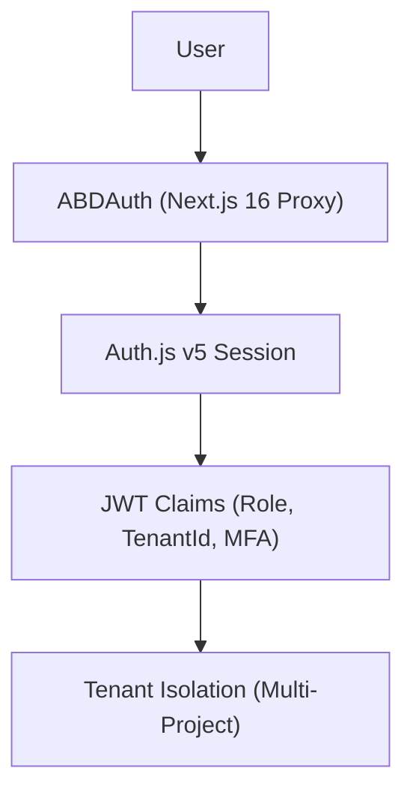
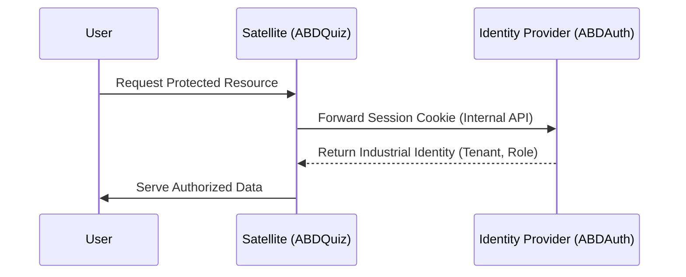

# Arquitectura Técnica - ABDAuth
**Certified Industrial Design (Era 19)**

## 1. El Corazón de la Identidad (Global Identity Provider)

ABDAuth es el componente central de identidad del ecosistema ABD. Su misión es gestionar el ciclo de vida del usuario de forma global y su relación con los diferentes productos (ABDQuiz, ABDAgRAG, etc.).

### Jerarquía de Identidad
Un usuario se autentica contra ABDAuth. A partir de ahí, se resuelven sus membresías a diferentes organizaciones (Tenants).

## 2. Orquestador de Seguridad (Proxy Guard)
Utilizamos la nueva convención `src/proxy.ts` de Next.js 16 para centralizar la seguridad:

1. **Edge Middleware**: Validación de sesión antes de cargar cualquier ruta protegida.
2. **i18n Orchestration**: Gestión de idioma basada en cookies (`NEXT_LOCALE`) sin prefijos en la URL para limpieza SEO.
3. **Tenant Routing**: Redirección automática basada en el contexto del usuario.

## 3. Estrategia de i18n (Simplified)
Para optimizar el rendimiento en Next.js 16 con Turbopack, utilizamos archivos de traducción monolíticos por idioma:

- `src/messages/es.json`: Diccionario maestro en Castellano.
- `src/messages/en.json`: Diccionario maestro en Inglés.
- `src/lib/i18n-config.ts`: Configuración centralizada de locales soportados.

## 4. Estándares de Diseño (Uncodixfy)
El sistema impone un diseño de alta densidad y baja fricción:
- **Radios Sharp**: Máximo 12px (`rounded-xl`).
- **Aseptic UI**: Fondos oscuros profundos, bordes de 1px de precisión, cero gradientes.
- **Responsive Core**: Componentes adaptativos para terminales industriales y dispositivos móviles.

## 5. Patrón de Componentes Modulares (Canonical Modular Components)
Para gestionar la complejidad de las interfaces administrativas y cumplir con los límites de longitud de archivos industriales, se adopta el patrón de descomposición canónica:
1. **`types.ts`**: Centralización de interfaces y tipos de acción.
2. **`[Entity]Card.tsx`**: Visualización atómica de registros.
3. **`[Entity]Form.tsx`**: Lógica de entrada de datos y validación.
4. **`[Entity]Dialog.tsx`**: Orquestador de modales y flujos de apertura.
5. **`PageHeader.tsx`**: Componente de cabecera estandarizado para toda la suite que unifica breadcrumbs, títulos industriales e indicadores interactivos de estado/acciones.
6. **`[Entity]ManagementContainer.tsx`**: Cerebro de orquestación de estado y API, integrando `PageHeader` y los componentes atómicos correspondientes.

## 6. Patrón de Federación (Ecosystem Identity Bridge)
Para integrar proyectos satélites sin duplicar la lógica de autenticación:

1. **Central Verification API**: ABDAuth expone `/api/auth/session` para validar tokens de forma segura.
2. **Server-Side Forwarding**: Los satélites (como ABDQuiz) reenvían las cookies de sesión desde su middleware al IdP central (ABDAuth) para validación en tiempo real.
3. **Identity Assertions**: El helper `ensureIndustrialAccess` garantiza que el contexto de Tenant y Rol sea coherente en todo el ecosistema federado.
4. **Zero-Trust Bridge**: La comunicación entre satélites y el IdP se realiza mediante peticiones servidor-servidor (RSC/Server Actions), protegiendo la sesión del cliente de manipulaciones externas.

## 7. Auditoría de Calidad Industrial (Zero-Noise)
El sistema impone un pipeline de certificación de 6 fases (`scripts/abd-audit.ps1`):
- **Code Quality**: ESLint 9 (Native Flat Config) nativo.
- **Type Safety**: TSC Strict con mapeo directo de binarios.
- **Purity Enforcement**: Patrón de subrayado estricto y prohibición de `any` no explícito.

## 8. Arquitectura de Esquemas Modularizados (Barrel Schemas)
Para mantener los archivos de modelos por debajo del límite estructural de 150 líneas y asegurar una alta cohesión técnica:
1. **Desacoplamiento de Esquemas**: Se han dividido los esquemas centrales en subarchivos específicos por dominio (`user.ts`, `tenant.ts`, `session.ts`, `application.ts`).
2. **Patrón Barrel Export**: El archivo central `src/lib/schemas/auth.ts` actúa como un concentrador que reexporta todos los esquemas individuales. Esto previene romper importaciones preexistentes a lo largo de la aplicación y respeta el principio DRY.

## 9. Robustecimiento Biométrico & Desafíos WebAuthn (Hito 5.6)
Para soportar el inicio de sesión passwordless de alta seguridad:
1. **Verificación FIDO2/WebAuthn**: Integración de `@simplewebauthn` en el IdP central.
2. **Almacenamiento de Desafíos**: Los desafíos (`challenges`) de registro/autenticación se persisten de forma temporal en la colección `webauthn_challenges` en MongoDB.
3. **Estrategia de Expiración (TTL)**: Dado el entorno serverless y distribuido de Next.js, se impone un índice de expiración TTL de 5 minutos sobre la propiedad `createdAt` de la colección de desafíos. Esto evita la dependencia de almacenamiento en memoria (que fallaría en balanceadores de carga) y previene la acumulación de datos obsoletos.
4. **Validación de Bypass Central**: El flujo biométrico expide un token JWT firmado de un solo uso y validez de 30 segundos (`passkeyBypassToken`) que el proveedor de credenciales verifica para otorgar la sesión del usuario.

---
**Firmado:** *Antigravity Architecture Board*

