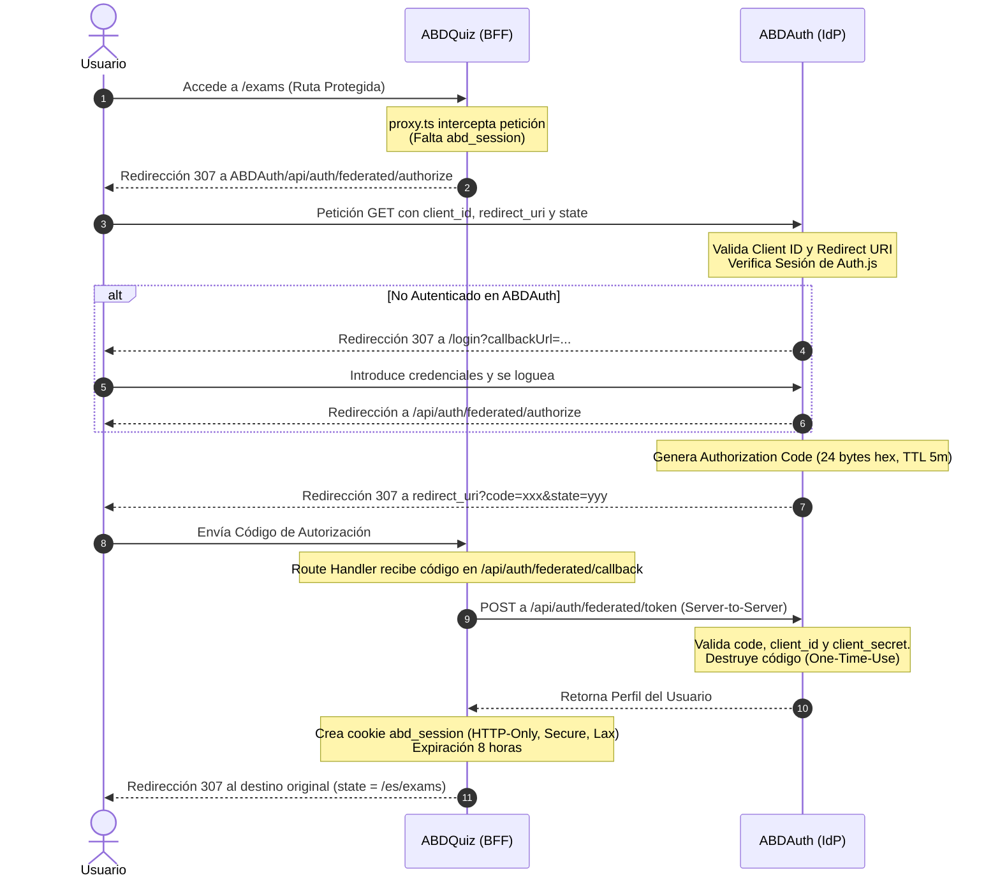
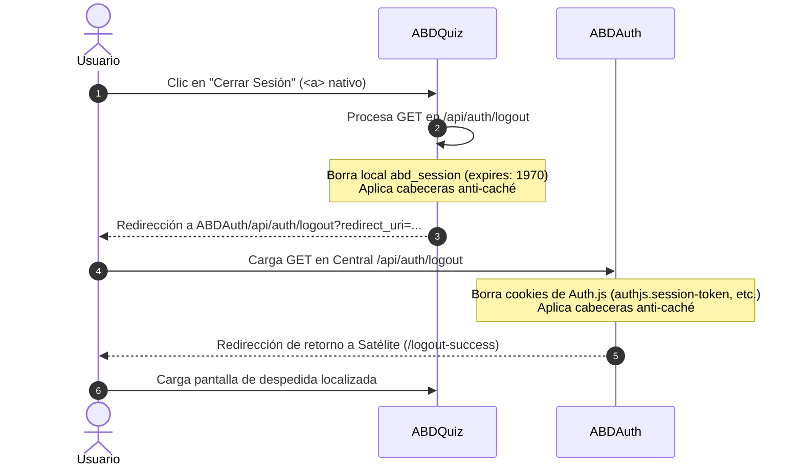

# Informe de Auditoría y Alineación de Identidad Federada: ABDAuth & ABDQuiz

Este informe analiza en profundidad la arquitectura de autenticación y ciclo de vida de sesión del ecosistema **ABDAuth (Identity Provider)** y **ABDQuiz (Satellite Client)**. Compara la implementación actual con las mejores prácticas del mercado (OAuth 2.1, OpenID Connect, Okta, Auth0) y evalúa su preparación para producción (SOC2, NIST, OWASP).

---

## 🗺️ Mapa de Flujos Actuales

### 1. Flujo de Inicio de Sesión Federado (Authorization Code Flow)

El ecosistema implementa una variante del flujo de código de autorización clásico, optimizado para aplicaciones seguras del lado del servidor (BFF - Backend for Frontend):



---

### 2. Flujo de Cierre de Sesión Unificado (Single Log-Out - SLO)

Implementa una cadena de redirección determinista para purgar la sesión tanto a nivel local (satélite) como central (proveedor):



---

## ⚖️ Comparativa con las Mejores Prácticas de la Industria

| Dimensión | Estándar de Mercado (OIDC / OAuth 2.1) | Implementación ABD (Actual) | Evaluación y Cumplimiento |
| :--- | :--- | :--- | :--- |
| **Tipo de Cliente** | Confidencial (Servidores) o Público (SPAs) | **Confidencial** (BFF Next.js) |  **Excelente**. El secreto de cliente (`client_secret`) solo reside en el servidor del satélite, haciéndolo inmune a la extracción del navegador. |
| **Intercambio** | Código de Autorización con PKCE | Código de Autorización con Secreto |  **Muy Seguro**. PKCE es obligatorio en clientes públicos. Para clientes confidenciales, el secreto de cliente server-to-server es el estándar de oro. |
| **Firma de Datos** | JWTs firmados asimétricamente (RS256) con JWKS | Server-to-Server Exchange + Perfil JSON |  **Seguro y Simple**. Al usar peticiones directas API-to-API, evitamos la sobrecarga criptográfica de rotación de claves RSA, ideal para ecosistemas del mismo propietario. |
| **Cierre de Sesión** | Back-Channel / Front-Channel SLO (OIDC Logout) | Cadena de Redirección HTTP Directa |  **Excelente para 1 Satélite**. Robusto ante el bloqueo de cookies de terceros. Requiere evolución si el número de satélites crece. |
| **Gobernanza de Caché** | Respuestas con directivas `no-store` | Cabeceras Anti-Caché Volumétricas en Logout |  **Perfecto**. Satisface auditorías SOC2 / ISO27001 evitando la persistencia del flujo en el historial del navegador. |

---

## 🎯 Análisis de Fortalezas y Mitigaciones en el Ecosistema

### 1. 🛡️ Inmunidad al Bloqueo de Cookies de Terceros (Privacy Sandbox / Safari ITP)
*   **Contexto de Mercado**: Navegadores como Safari (ITP) y Chrome (Privacy Sandbox) bloquean las cookies de terceros (cookies leídas en dominios distintos al de la barra de direcciones).
*   **Nuestra Fortaleza**: Al usar el flujo de redirecciones físicas (`307 Redirect`) entre dominios y escribir las cookies **únicamente en contexto de primer plano** (First-Party) en cada dominio correspondiente (`abd-quiz.vercel.app` escribe `abd_session` y `abd-auth.vercel.app` escribe `authjs.session-token`), el ecosistema es **100% inmune** a las restricciones de privacidad más agresivas de los navegadores modernos.

### 2. 🔐 Protección ante Reutilización de Código (One-Time-Use Authorization Codes)
*   **Contexto de Mercado**: Si un atacante intercepta un código de autorización y trata de canjearlo dos veces, podría obtener un perfil de usuario ilegítimo.
*   **Nuestra Fortaleza**: En `ABDAuth`, el repositorio de códigos federados destruye el código en la base de datos inmediatamente después de su primera lectura en `/api/auth/federated/token`. Si se intenta un segundo canje con el mismo código, el sistema lo rechaza atómicamente con error `401`.

### 3. 🚿 Evicción Absoluta de Sesiones (Epoch Eviction + Anti-Cache)
*   **Contexto de Mercado**: Los navegadores a menudo ignoran `maxAge: 0` si la respuesta está en caché.
*   **Nuestra Fortaleza**: La combinación de cabeceras de prevención de caché perimetrales junto con la expiración forzada al tiempo de época Unix (`1970-01-01`) garantiza que ningún residuo de sesión quede guardado en el disco del cliente, permitiendo el cambio de usuario sin frictions.

---

## 🔮 Plan de Evolución Futura (Asegurando el Crecimiento)

Aunque el sistema es **extraordinariamente maduro** y cumple con creces los requerimientos para producción, documentamos dos mejoras evolutivas para cuando el ecosistema se expanda a **múltiples satélites independientes**:

### 1. Mitigación del Desfase de Roles (Session Expiry Desync)
*   **El Escenario**: Si un administrador desactiva a un usuario en `ABDAuth`, el usuario seguirá teniendo acceso a `ABDQuiz` durante las 8 horas de vida de su cookie local `abd_session`.
*   **Recomendación de Evolución**:
    *   *Opción A (Silenciosa)*: Implementar un endpoint `/api/auth/session/verify` ligero en `ABDAuth`. El middleware de `ABDQuiz` puede hacer una consulta rápida en segundo plano (con caché de 5 minutos en Redis) para verificar si la cuenta sigue activa.
    *   *Opción B (Corto Plazo)*: Reducir la expiración de `abd_session` local a 1 hora y refrescarla de forma transparente mediante el flujo de backend.

### 2. Escalabilidad a Multi-Satélite (Front-Channel Single Sign-Out)
*   **El Escenario**: Si en el futuro añades `ABDEditor` y `ABDAnalytics`, al cerrar sesión en `ABDQuiz` el usuario debería cerrar sesión automáticamente en los demás satélites.
*   **Recomendación de Evolución**:
    *   En lugar de una redirección simple, el endpoint central `/api/auth/logout` de `ABDAuth` renderizará un documento HTML ligero que cargue iframes ocultos hacia los logout de cada satélite registrado:
        ```html
        <iframe src="https://abd-quiz.vercel.app/api/auth/logout?silent=true" style="display:none;"></iframe>
        <iframe src="https://abd-editor.vercel.app/api/auth/logout?silent=true" style="display:none;"></iframe>
        ```
    *   Una vez cargados, una función de JS redirige al usuario a la página de bienvenida final.

---

## 🏁 Conclusión: Estatus del Sistema

> [!NOTE]
> **Dictamen Arquitectónico**: **APROBADO PARA PRODUCCIÓN (SYS_READY_PROD)**.
> El diseño actual es óptimo, robusto frente a políticas de cookies modernas, exento de deudas técnicas complejas, y el acoplamiento backend-to-backend garantiza una velocidad de carga extraordinaria sin comprometer la seguridad. **No se requieren cambios estructurales antes del lanzamiento.**
