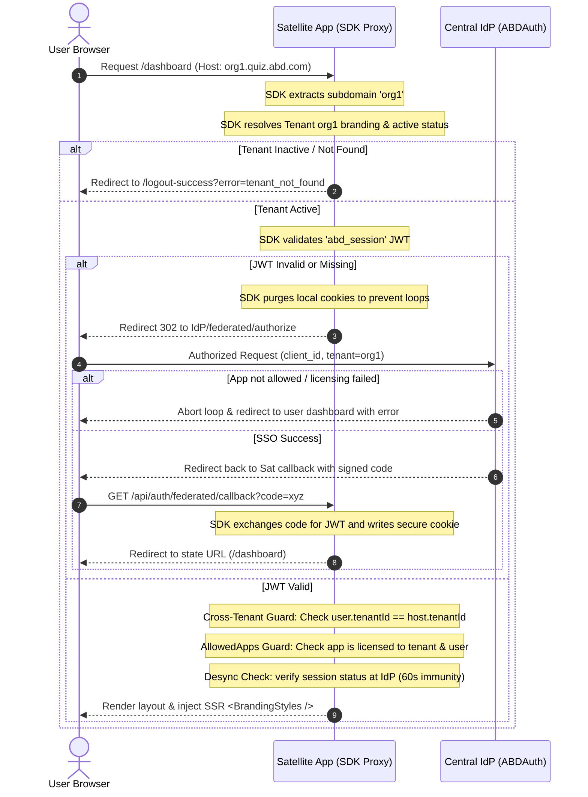

# Technical Documentation: `@ajabadia/satellite-sdk` (v1.0.4)

This document specifies the technical architecture, cryptographic verification, security boundaries, database connections, resilience helpers, and API signatures of the `@ajabadia/satellite-sdk` package.

---

## 🗺️ Architectural Flow & Security Handshake

The SDK operates as a centralized middleware and server utility layer to enforce authentication, tenant isolation, and white-label branding.



---

## 🛠️ API Reference

### 1. Proxy Guard Decorator: `withIndustrialAuth(options)`
Higher-order function designed to intercept incoming requests at the Edge.

```typescript
export function withIndustrialAuth(options: IndustrialAuthOptions): (request: NextRequest) => Promise<NextResponse>;
```

#### Configuration Options (`IndustrialAuthOptions`):
- `appId`: Unique slug of the application (e.g., `'quiz'`).
- `clientId`: Client OAuth registration ID.
- `clientSecret`: Client Secret for session validation.
- `jwtSecret`: Secret used to cryptographically verify JWT signatures locally.
- `authProviderUrl`: Base URL of the Identity Provider (default: `process.env.AUTH_PROVIDER_URL`).
- `baseAppUrl`: Fallback URL of the satellite app (default: `process.env.NEXT_PUBLIC_APP_URL`).
- `publicPaths`: Path prefixes bypassed from authentication (default: `['/', '/logout-success']`).
- `intlMiddleware`: Optional `next-intl` or next/router middleware function to chain.

---

### 2. Catch-All API Route Handler: `createAuthRouteHandler(options)`
Generates a Next.js App Router API Route handler. Map this inside `src/app/api/auth/[...auth]/route.ts`.

#### Internal Paths Handled:
- `GET /api/auth/session`: Returns `{ authenticated: boolean, user?: UserProfile }`.
- `GET /api/auth/logout`: Clears session cookies and redirects to IdP logout (supports `?silent=true` to wipe cookies locally and return a 200).
- `GET /api/auth/federated/callback`: Exchanges the OAuth code for a JWT token, writing the `abd_session` cookie securely.

---

### 3. Server-Side Session Utilities

#### `getIndustrialSession(jwtSecret?)`
Decrypts and parses the JWT token stored in the `abd_session` cookie using `jose`.
```typescript
export async function getIndustrialSession(customSecret?: string): Promise<FederatedSession>;
```

#### `ensureIndustrialAccess(requiredRole?, jwtSecret?)`
Guards layout components, server actions, or custom API endpoints.
- Throws `UNAUTHORIZED_ECOSYSTEM_ACCESS` if the session is invalid.
- Throws `INSUFFICIENT_INDUSTRIAL_PRIVILEGES` if the user role does not match (unless the user has the `SUPER_ADMIN` role).
```typescript
export async function ensureIndustrialAccess(requiredRole?: string, customSecret?: string): Promise<UserProfile>;
```

---

### 4. Zero-FOUC White-Label Styles: `<BrandingStyles />`
React Server Component that resolves the tenant based on the request host header, retrieves the branding properties, converts them to Tailwind CSS v4 variables (via `@ajabadia/styles`), and injects them synchronously in the `<head>` to prevent flashes of unstyled content.

```tsx
import { BrandingStyles } from '@ajabadia/satellite-sdk';

// Usage inside root layout.tsx:
<head>
  <BrandingStyles />
</head>
```

---

### 5. Client Session Hooks: `SessionProvider` & `useSession()`
Client-side context to access session information reactively.
- **Provider**: `<SessionProvider initialSession={session}>` should wrap the application layout.
- **Hook**: `const { session, status, update } = useSession();` returns the session state (`status` can be `'loading' | 'authenticated' | 'unauthenticated'`).

---

### 6. Multi-Tenant Database Module

The SDK provides robust multi-tenant and multi-cluster connection routing natively using Mongoose.

#### Connections:
- `connectDB()`: Connects to the `MONGODB_URI` DATA cluster. Resolves tenant-specific collections dynamically when executing within `withTenantContext`.
- `connectAuthDB()`: Connects to `MONGODB_AUTH_URI` for global access tables (e.g. Users, Tenants).
- `connectLogsDB()`: Connects to `MONGODB_LOGS_URI` for audit log buffers.

#### Tenant Isolation Context:
```typescript
import { withTenantContext } from '@ajabadia/satellite-sdk';

await withTenantContext(async () => {
  // Any Mongoose queries here automatically query the active tenant's collection
  const items = await TenantModel.find();
});
```

#### Shared Models Resolution:
- `getTenantModel(modelName, schema)`: Returns a dynamic proxy model that routes database commands to the appropriate collection based on the tenant context (e.g. `banco-parque_users`).
- `getGlobalModel(modelName, schema, clusterTarget)`: Compiles a global model on a specific database cluster (e.g., `AUTH` or `LOGS`) instead of routing it dynamically to tenant collections.
  - Target: `'AUTH' | 'LOGS'`

---

### 7. Administrative Tenant Resolution

Allows administrative applications to dynamically shift context to a target tenant DB context.

#### `resolveTargetTenantContext(tenantId)`
Resolves the database prefix and isolation strategy of a target tenant from the central database.
```typescript
import { resolveTargetTenantContext } from '@ajabadia/satellite-sdk';

const context = await resolveTargetTenantContext('banco-parque');
// Result: { tenantId: 'banco-parque', dbPrefix: 'banco-parque', isolationStrategy: 'COLLECTION_PREFIX' }
```

---

### 8. Resilience Helpers (Circuit Breaker & Rate Limiter)

#### `CircuitBreaker`
Protects external resources and APIs from cascading failures.
```typescript
import { CircuitBreaker } from '@ajabadia/satellite-sdk';

const breaker = new CircuitBreaker(async () => {
  return await fetch('https://api.external.service');
}, { failureThreshold: 5, recoveryTimeoutMs: 10000 });

const result = await breaker.execute();
```

#### `RateLimiter`
Controls access frequencies in serverless route handlers and actions.
```typescript
import { RateLimiter } from '@ajabadia/satellite-sdk';

const limiter = new RateLimiter({ windowMs: 60000, maxRequests: 100 });
const hasAllowed = await limiter.limit('user_ip_address');
```

---

### 9. Security Services & Cryptography

#### `SecurityService`
Provides secure AES-256-CBC encryption/decryption using the centralized `ENCRYPTION_SECRET` variable.
```typescript
import { SecurityService } from '@ajabadia/satellite-sdk';

const encrypted = SecurityService.encrypt('sensitive data');
const decrypted = SecurityService.decrypt(encrypted);
```

#### `computeBlockHash(previousHash, currentPayload)`
Computes cryptographic hashes for forensic audit chains (logs integrity validation).
```typescript
import { computeBlockHash } from '@ajabadia/satellite-sdk';

const hash = computeBlockHash('prev_hash_123', { action: 'delete', userId: 'usr_abc' });
```

---

### 10. Logger with Offline Buffering
A fail-safe logger that buffers audit logs locally when the central logs cluster is unreachable.

```typescript
import { logger, configureLogger } from '@ajabadia/satellite-sdk';

configureLogger({ appId: 'quiz', minLevel: 'INFO' });

// Log custom information
logger.info('User initiated quiz', { quizId: 'q_123' });

// Log secure audit event (propagated to Central Logs Cluster)
await logger.audit({
  userId: 'usr_abc',
  tenantId: 'tenant-123',
  action: 'QUIZ_START',
  details: { examId: 'ex_890' }
});
```

---

### 11. Centralized Email Dispatching: `ResendEmailService`
A zero-dependency server utility class to send emails using the Resend REST API.

```typescript
import { ResendEmailService } from '@ajabadia/satellite-sdk';

await ResendEmailService.sendEmail({
  to: 'recipient@example.com',
  subject: 'Notification Subject',
  html: '<h1>Centralized Email</h1><p>Sent from SDK.</p>',
});
```

---

### 12. Branding Color Utilities & Assets Management

> [!NOTE]
> The primary styling engine and color conversion helper algorithms live in `@ajabadia/styles`. The SDK re-exports them and provides integration components (like `<BrandingStyles />`) for microservice convenience.

#### Color Methods Re-exported:
- `adjustColor(hex, percent)`: Lightens/darkens a hex color code.
- `getContrastColor(hex)`: Decides whether text on top of the hex color should be white (`#ffffff`) or black (`#000000`).
- `hexToHslComponents(hex)`: Converts a hex code to HSL parameters.
- `generateTenantCss(theme)`: Generates CSS custom properties for Tailwind injection.

#### Cloudinary Branding Asset Operations:
- `uploadBrandingAsset(fileBase64, folder)`: Securely uploads a tenant logo or favicon to Cloudinary.
- `deleteCloudinaryAsset(publicId)`: Deletes an asset from Cloudinary.
