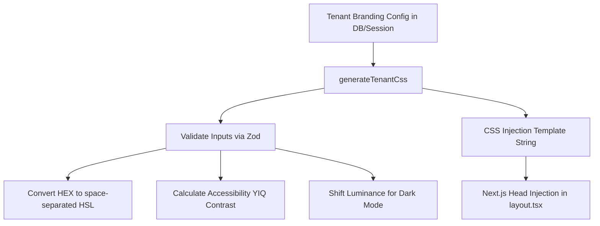

# Technical Architecture Guide - `@ajabadia/styles`

This document details the mathematical styling algorithms, Tailwind CSS v4 variables architecture, and Next.js layout integration patterns of the unified `@ajabadia/styles` ecosystem.

---

## 🏛️ System Architecture Overview

The `@ajabadia/styles` library provides a **0ms-latency styling compilation engine** designed to compile dynamic, accessible tenant-brand themes inside Next.js Server Components (`SSR`).



---

## 🧪 Styling & Math Algorithms

### 1. Tailwind CSS v4 HSL Component Mapping
Tailwind CSS v4 custom variables (such as `--primary`) are defined inside the `@theme` directive using the `hsl()` wrapper over raw HSL components:
```css
@theme {
  --color-primary: hsl(var(--primary));
}
```
To support dynamic opacity modifiers (`bg-primary/50`), the raw HSL properties must be defined as space-separated component values (e.g. `217 91.2% 59.8%` instead of `hsl(217, 91.2%, 59.8%)`).

The algorithm `hexToHslComponents(hex)` splits a standard hexadecimal string into three normalized components:
*   **Hue ($H$)**: $0^\circ \to 360^\circ$
*   **Saturation ($S$)**: $0\% \to 100\%$
*   **Lightness ($L$)**: $0\% \to 100\%$

```typescript
// hexToHslComponents("#3b82f6") -> "217 91.2% 59.8%"
```

### 2. High-Fidelity YIQ Contrast Algorithm
To enforce strict WCAG accessibility readability guidelines automatically, we utilize the **YIQ Color Space Luminance formula**. 

The formula converts RGB color channels to a brightness value ($Y$) between $0$ and $255$:
$$Y = \frac{(R \times 299) + (G \times 587) + (B \times 114)}{1000}$$

*   If $Y \geq 128$: The color is bright $\implies$ the text must be black (`#000000`).
*   If $Y < 128$: The color is dark $\implies$ the text must be white (`#ffffff`).

```typescript
export function getContrastColor(hexcolor: string): string {
  const r = parseInt(hexcolor.substring(1, 3), 16);
  const g = parseInt(hexcolor.substring(3, 5), 16);
  const b = parseInt(hexcolor.substring(5, 7), 16);
  const yiq = ((r * 299) + (g * 587) + (b * 114)) / 1000;
  return (yiq >= 128) ? '#000000' : '#ffffff';
}
```

### 3. Hex Bitwise Luminance Shifting
For dark-mode compatibility, saturated primary colors selected by tenants can look muddy or blinding against deep black canvases. We adjust the color's luminance programmatically by performing high-performance bitwise hexadecimal shifts:

$$\text{Channel} = \min(255, \max(0, \text{Channel} + \text{percent} \times 2.55))$$

```typescript
export function adjustColor(hex: string, percent: number): string {
  const num = parseInt(hex.replace("#", ""), 16);
  const amt = Math.round(2.55 * percent);
  const R = (num >> 16) + amt;
  const G = (num >> 8 & 0x00FF) + amt;
  const B = (num & 0x0000FF) + amt;
  // returns lighter/darker clamped hex color...
}
```

---

## 🛡️ Input Sanitization & CSS Injection Security

To prevent malicious stylesheet injection or cross-site scripting (XSS) via brand colors (e.g., passing a color like `red; body { display: none }`), all theme parameters are validated strictly in the backend and engine boundaries using **Zod schemas**:

```typescript
export const hexColorSchema = z.string().regex(/^#[0-9a-fA-F]{6}$/);
```

Any invalid inputs are discarded, and the engine automatically falls back to the safe, default industrial **Tech-Noir Cyan** theme.

---

## 🛰️ Integration Guide for Sibling Applications

### 1. Installation via Git Dependency (Vercel Native)
Add the central repository link directly to the `package.json` of the consumer application (`ABDQuiz`, `ABDAuth`, etc.):
```json
{
  "dependencies": {
    "@ajabadia/styles": "git+https://github.com/ajabadia/ABDStyles.git#main"
  }
}
```
This is fully compatible with Vercel's build container, enabling private or public Git checkouts during deployments without a private NPM registry fee.

### 2. Implementation in Next.js Root Layout (`layout.tsx`)
In corporate/satelite layout modules, retrieve the active tenant session metadata and render the computed CSS string directly into the server-rendered `<head>` block to avoid visual styles flashing (FOUC):

```tsx
import { generateTenantCss } from '@ajabadia/styles';
import { getActiveTenant } from '@/lib/tenant-service'; // Your db/session locator

export default async function RootLayout({ children }: { children: React.ReactNode }) {
  const tenant = await getActiveTenant();
  
  // Compile the style tag server-side in micro-seconds
  const tenantCustomCss = tenant?.branding?.theme 
    ? generateTenantCss(tenant.branding.theme) 
    : '';

  return (
    <html lang="es">
      <head>
        {tenantCustomCss && (
          <style 
            id="tenant-branding-gateway" 
            dangerouslySetInnerHTML={{ __html: tenantCustomCss }} 
          />
        )}
      </head>
      <body className="antialiased">
        {children}
      </body>
    </html>
  );
}
```
