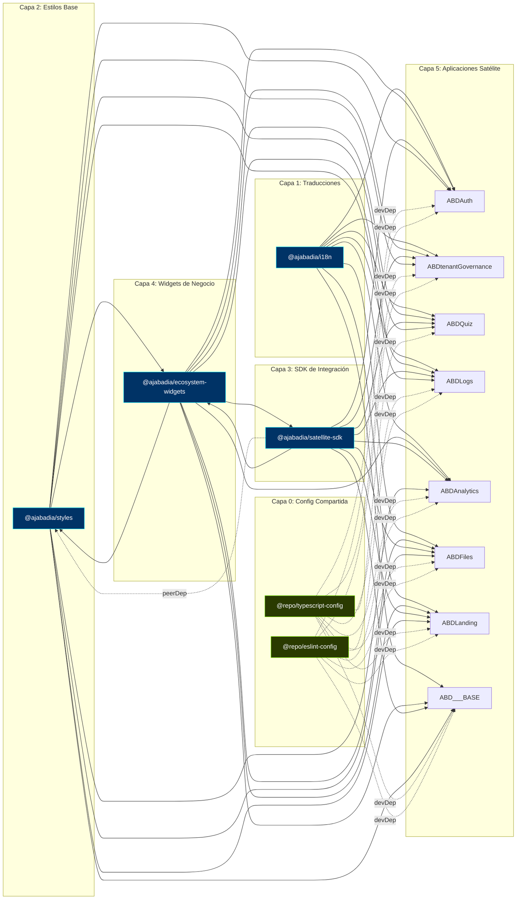
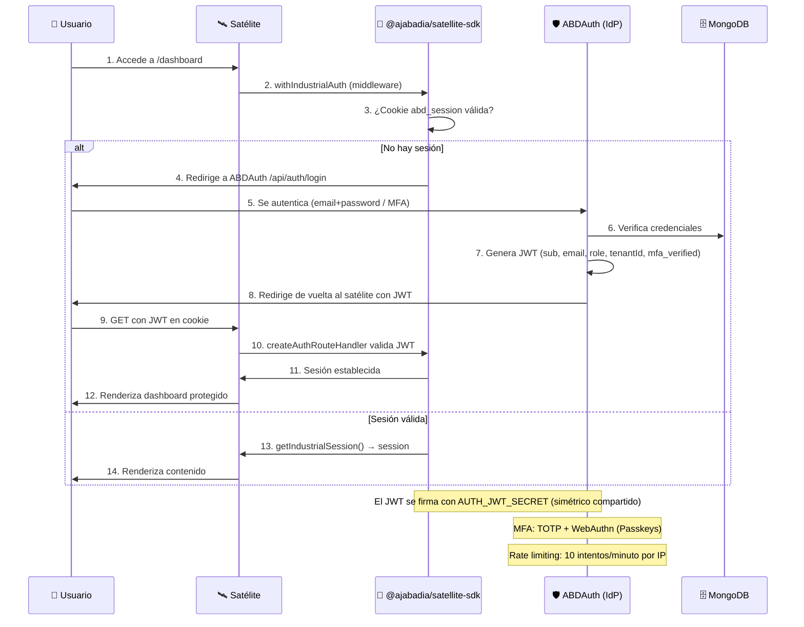
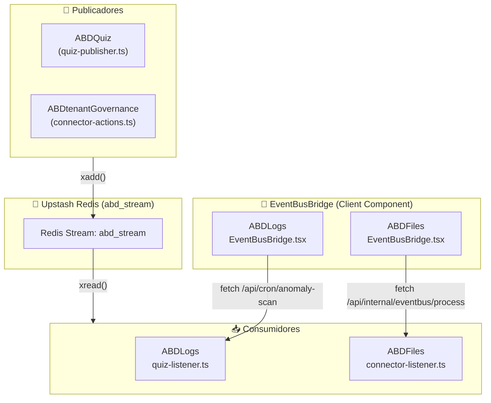
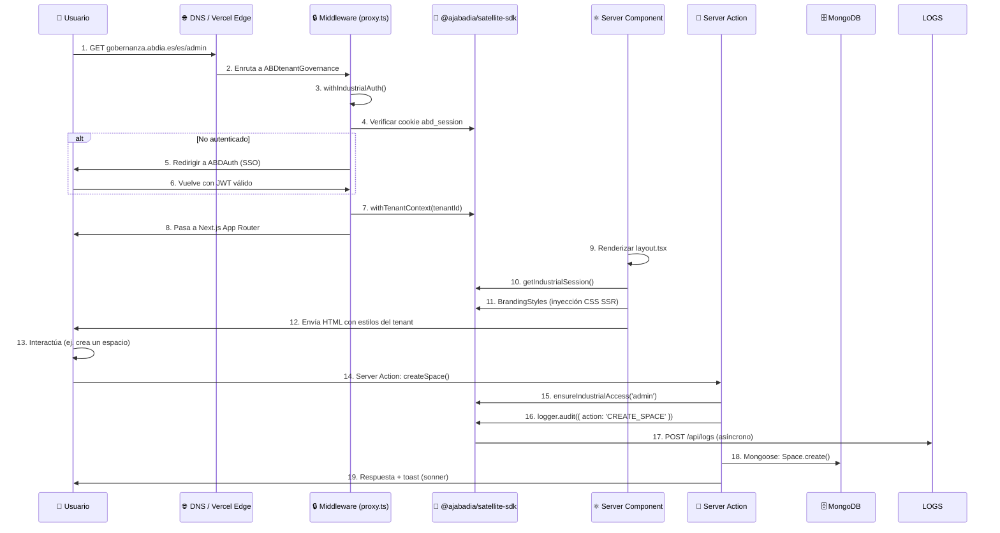
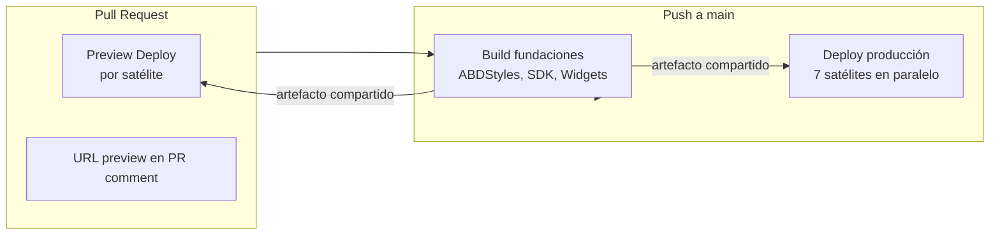

# ABD Suite — Arquitectura del Ecosistema

> **Versión**: 2.0 — Julio 2026
> **Stack**: Next.js 16 · React 19 · Tailwind CSS v4 · MongoDB/Mongoose 9 · pnpm Workspaces · Turborepo

---

## 1. Vista General del Monorepo

El ecosistema ABD Suite se organiza como un **monorepo** orquestado por `pnpm workspaces` + `Turborepo`. Contiene **4 librerías compartidas** (publicadas como NPM en GitHub Packages), **8 aplicaciones satélite** (desplegadas como proyectos independientes en Vercel), y **2 paquetes de configuración interna** (`packages/typescript-config`, `packages/eslint-config`).

```mermaid
graph TB
    subgraph Root["🏢 Monorepo (ABDSuite)"]
        direction TB

        subgraph Config["⚙️ Configuración Compartida"]
            TC["@repo/typescript-config<br/>base.json, nextjs.json, library.json"]
            EC["@repo/eslint-config<br/>nextjs.mjs"]
        end

        subgraph Libs["📦 Librerías Compartidas (NPM - GitHub Packages)"]
            I18N["@ajabadia/i18n<br/>Traducciones centralizadas"]
            STYLES["@ajabadia/styles<br/>Motor de estilos SSR<br/>Componentes UI"]
            SDK["@ajabadia/satellite-sdk<br/>Auth · Sesión · Logging ·<br/>EventBus · Branding"]
            WIDGETS["@ajabadia/ecosystem-widgets<br/>Smart components<br/>SmartNavbar · CommandPalette"]
        end

        subgraph E2E["🧪 Tests de Integración"]
            E2E["@ajabadia/e2e<br/>Playwright E2E cross-satélite"]
        end

        subgraph Satellites["🛰️ Aplicaciones Satélite (Vercel)"]
            AUTH["ABDAuth<br/>Identity Provider (IdP)<br/>puerto:5001"]
            TENANT["ABDtenantGovernance<br/>Control Plane<br/>puerto:5002"]
            QUIZ["ABDQuiz<br/>Simulador de Exámenes<br/>puerto:5020"]
            LOGS["ABDLogs<br/>Logging Forense<br/>puerto:5003"]
            ANALYTICS["ABDAnalytics<br/>Analíticas y KPIs<br/>puerto:5004"]
            FILES["ABDFiles<br/>Gestor Documental<br/>puerto:5005"]
            LANDING["ABDLanding<br/>Landing Corporativa<br/>puerto:5000"]
            BASE["ABD___BASE<br/>Template Base<br/>puerto:3900"]
        end
    end

    style Root fill:#0a0a1a,stroke:#00f0ff,stroke-width:2px
    style Config fill:#0a1a0a,stroke:#88ff00,stroke-width:1px
    style Libs fill:#0a1a2a,stroke:#00ff88,stroke-width:1px
    style E2E fill:#1a1a0a,stroke:#ff8800,stroke-width:1px
    style Satellites fill:#1a0a2a,stroke:#ff00ff,stroke-width:1px
```

| Rol | Paquete | Publicado como | Versión actual |
|-----|---------|---------------|:---:|
| Traducciones | `ABDi18n` | `@ajabadia/i18n` | 1.0.53 |
| Estilos | `ABDStyles` | `@ajabadia/styles` | 1.0.104 |
| SDK | `ABDSatelliteSDK` | `@ajabadia/satellite-sdk` | 1.0.101 |
| Widgets | `ABDEcosystemWidgets` | `@ajabadia/ecosystem-widgets` | 1.0.94 |
| IdP | `ABDAuth` | — | 0.1.0 |
| Control Plane | `ABDtenantGovernance` | — | 0.1.0 |
| LMS | `ABDQuiz` | — | 0.1.0 |
| Logs | `ABDLogs` | — | 0.1.0 |
| Analytics | `ABDAnalytics` | — | 0.1.0 |
| Files | `ABDFiles` | — | 0.1.0 |
| Landing | `ABDLanding` | — | 0.1.0 |
| Template | `ABD___BASE` | — | 0.1.0 |
| E2E | `ABDE2E` | — | 0.1.0 |

---

## 2. Grafo de Dependencias entre Paquetes

Las librerías compartidas forman una cadena de dependencias que los satélites consumen. El orden de compilación en Turborepo es:

`ABDi18n → ABDStyles → ABDSatelliteSDK → ABDEcosystemWidgets → (satélites)`

Además, cada satélite consume `@repo/typescript-config` y `@repo/eslint-config` como devDependencies para estandarizar TypeScript y ESLint.



### Paquetes de Configuración (`packages/`)

| Paquete | Contenido | Consumido por |
|---------|-----------|---------------|
| `@repo/typescript-config` | `base.json`, `nextjs.json`, `library.json` | Todos los satélites Next.js + ABDQuiz |
| `@repo/eslint-config` | `nextjs.mjs` (extiende `eslint-config-next` + `@eslint/compat`) | Todos los satélites excepto ABDQuiz (usa config propia) |

### Subpaths exportados por `@ajabadia/satellite-sdk`

El SDK expone 10 submódulos independientes para import selectivo:

| Subpath | Propósito |
|---------|-----------|
| `.` (core) | Funciones principales: `getIndustrialSession`, `withIndustrialAuth`, `ensureIndustrialAccess` |
| `./auth-middleware` | Middleware de autenticación para Next.js (`createAuthRouteHandler`) |
| `./client` | `SessionProvider`, `BrandingStyles` (componentes React client-side) |
| `./db` | Conexiones Mongoose multi-tenant (`getTenantModel`, `getTenantConnection`) |
| `./logger` | Logging forense centralizado (`logger.audit`) |
| `./event-bus` | Mensajería asíncrona vía Redis Streams (publisher, consumer, schema registry) |
| `./styles` | Temas dinámicos SSR (`BrandingStyles`) |
| `./contracts` | Tipos compartidos Zod (sesión, tenant, evento) |
| `./utils` | Utilidades varias |

---

## 3. Flujo de Autenticación (SSO Federado)

Todos los satélites delegan la autenticación en **ABDAuth** (IdP central) mediante OAuth2. El SDK `@ajabadia/satellite-sdk` abstrae todo el flujo: `withIndustrialAuth` (middleware), `createAuthRouteHandler` (API routes), `getIndustrialSession` (lectura de sesión) y `BrandingStyles` (tema dinámico SSR).



> **COOKIE_DOMAIN Caveat (Local Dev):** `COOKIE_DOMAIN=.abdia.es` permite compartir la cookie `abd_session` entre subdominios en producción. En localhost el navegador rechaza cookies con `Domain=.abdia.es`, causando redirect loop. Para desarrollo local, `COOKIE_DOMAIN` debe estar comentado (ver `.env.shared`).

---

## 4. Arquitectura Multi-Tenant

Cada inquilino (tenant) opera de forma aislada. El sistema soporta tres estrategias de aislamiento configurables desde `ABDtenantGovernance`.

```mermaid
graph TB
    subgraph ControlPlane["🎮 Plano de Control"]
        GOV["ABDtenantGovernance"]
        GOV --> DB_GOV[(MongoDB: governance<br/>tenants, espacios, usuarios)]
    end

    subgraph TenantA["🏢 Tenant: Academia Alpha"]
        USERS_A["Usuarios Alpha"]
        DATA_A[(MongoDB: abd_tenant_alpha<br/>o colección: alpha_quiz)]
        STORAGE_A["☁️ Cloudinary / Google Drive<br/>(config por tenant)"]
    end

    subgraph TenantB["🏢 Tenant: Corporación Beta"]
        USERS_B["Usuarios Beta"]
        DATA_B[(MongoDB: abd_tenant_beta<br/>o colección: beta_quiz)]
        STORAGE_B["☁️ OneDrive / S3<br/>(config por tenant)"]
    end

    GOV -.->|"Configuración"| TenantA
    GOV -.->|"Configuración"| TenantB

    subgraph Apps["🛰️ Satélites Multi-Tenant"]
        QUIZ["ABDQuiz"]
        LOGS["ABDLogs"]
        FILES["ABDFiles"]
        ANALYTICS["ABDAnalytics"]
    end

    Apps --> TenantA
    Apps --> TenantB

    style ControlPlane fill:#0a1a0a,stroke:#00ff88
    style TenantA fill:#1a1a0a,stroke:#ffff00
    style TenantB fill:#1a0a1a,stroke:#ff00ff
```



### Estrategias de Aislamiento

| Estrategia | Descripción | Cuándo usarla |
|-----------|-------------|---------------|
| `COLLECTION_PREFIX` | Misma base de datos, colecciones prefijadas | Plan gratuito de MongoDB Atlas (1 DB) |
| `DATABASE_PER_TENANT` | Base de datos dedicada por tenant | Clientes enterprise |
| **Híbrido** | Pool de conexiones dinámico con `getTenantModel()` | Transición entre estrategias |

El helper `getTenantModel` (en cada satélite) conmuta automáticamente el modelo Mongoose según el `tenantId` de la sesión, usando `AsyncLocalStorage` para el contexto del hilo.

---

## 5. Mapa de Interacción entre Servicios

```mermaid
graph TB
    subgraph Satellites["🛰️ Satélites"]
        QUIZ["ABDQuiz"]
        TENANT["ABDtenantGovernance"]
        FILES["ABDFiles"]
        LANDING["ABDLanding"]
        ANALYTICS["ABDAnalytics"]
    end

    subgraph Core["⚙️ Servicios Centrales"]
        AUTH["ABDAuth<br/>IdP"]
        LOGS["ABDLogs<br/>Logging Forense"]
    end

    subgraph External["☁️ Servicios Externos"]
        MDB[(MongoDB Atlas)]
        REDIS[(Upstash Redis<br/>EventBus Streams)]
        CLOUD[Cloudinary]
        S3[AWS S3]
        GDRIVE[Google Drive API]
        ODRIVE[Microsoft Graph API]
        RESEND[Resend<br/>Email Transaccional]
    end

    QUIZ -->|"SSO OAuth2"| AUTH
    TENANT -->|"SSO OAuth2"| AUTH
    FILES -->|"SSO OAuth2"| AUTH
    LANDING -->|"SSO OAuth2"| AUTH
    ANALYTICS -->|"SSO OAuth2"| AUTH

    QUIZ -->|"logger.audit"| LOGS
    TENANT -->|"logger.audit"| LOGS
    FILES -->|"logger.audit"| LOGS
    AUTH -->|"logger.audit"| LOGS
    ANALYTICS -->|"logger.audit"| LOGS

    QUIZ -->|"EventBus: publisher"| REDIS
    TENANT -->|"EventBus: publisher"| REDIS

    REDIS -->|"EventBus: consumer"| LOGS
    REDIS -->|"EventBus: consumer"| FILES

    TENANT -->|"CRUD tenants, espacios, roles"| AUTH
    FILES -->|"consulta espacios"| TENANT

    FILES --> CLOUD
    FILES --> S3
    FILES --> GDRIVE
    FILES --> ODRIVE

    AUTH --> MDB
    TENANT --> MDB
    QUIZ --> MDB
    LOGS --> MDB
    FILES --> MDB
    ANALYTICS --> MDB

    AUTH --> RESEND

    style Core fill:#0a1a2a,stroke:#00f0ff,stroke-width:2px
    style Satellites fill:#1a0a2a,stroke:#ff00ff
    style External fill:#0a0a1a,stroke:#00ff88
```



### Protocolos de Comunicación

| Origen → Destino | Protocolo | Autenticación |
|-----------------|-----------|---------------|
| Satélite → ABDAuth | HTTP (OAuth2 redirect) | JWT + cookie de sesión |
| Satélite → ABDLogs | HTTP POST (fetch) | `x-logs-token` (secreto compartido) |
| ABDtenantGovernance → ABDAuth | HTTP (API interna) | `x-internal-iam-key` |
| ABDtenantGovernance → Satélites | HTTP POST (S2S GDPR Export) | `x-internal-secret` |
| ABDFiles → Webhooks externos | HTTP POST con HMAC | HMAC-SHA256 firmado |
| Satélite → Upstash Redis | Redis Streams (xadd/xread) | `UPSTASH_REDIS_REST_TOKEN` |

### 5.1 EventBus (Mensajería Asíncrona con Redis Streams)

Para desacoplar interacciones cross-satélite se implementa un **EventBus** distribuido basado en **Redis Streams** (Upstash Redis REST API), con schema registry en memoria (Zod) para validación de eventos.



- **Publisher**: `createPublisher()` del SDK construye un envelope validado contra el schema registry y lo publica vía `xadd()` en el stream Redis.
- **Consumer**: `createConsumer()` del SDK crea un polling que lee con `xread()` y distribuye eventos a handlers registrados.
- **Bridge**: Los componentes `<EventBusBridge>` (client component) en los layouts de ABDLogs y ABDFiles ejecutan triggers periódicos (cada 5 min + al recuperar foco) para procesar eventos pendientes. Esta arquitectura es necesaria porque Vercel no permite listeners persistentes.
- **Schema Registry**: Registro en memoria de esquemas Zod versionados. Valida envelopes antes de publicar/consumir.
- **Dashboard de monitoreo**: `/admin/eventbus` en ABDLogs, con métricas de longitud de streams y eventos recientes.

### 5.2 Estrategia de Pruebas de Integración (Playwright)

El proyecto **`ABDE2E`** (`@ajabadia/e2e`) unifica las pruebas E2E cross-satélite con Playwright:

| Test | Archivo | Descripción |
|------|---------|-------------|
| SSO Federado + MFA | `tests/federated-auth.spec.ts` | Login, sesión compartida entre subdominios, ventana de inmunidad MFA (300s) |
| Pipeline EventBus | `tests/eventbus-pipeline.spec.ts` | Alumno inicia/completa examen → evento via Redis → ABDLogs lo registra |
| Seguridad Multi-Tenant | `tests/multitenant-security.spec.ts` | Creación de tenant, invitación de usuario, aislamiento de datos |

Las pruebas se ejecutan contra `localhost` mapeando dominios `*.abdia.es` en `hosts` para permitir cookies cross-subdominio.

### 5.3 Monitoreo de Anomalías

El ecosistema unifica seguridad operacional a través de dos canales que convergen en el panel **Alert History** de ABDLogs:

1. **Evaluación en tiempo real**: Toda entrada en `central_audit_logs` es evaluada por `AlertService.evaluateLog()` contra umbrales definidos.
2. **Detección predictiva** (`AnomalyEngine`): Escaneo periódico (cada 5 min + `visibilitychange`) del volumen de eventos por tenant, activado por `<EventBusBridge>`. Anomalías `HIGH`/`CRITICAL` se elevan como alertas operativas.

---

## 6. Ciclo de Vida de una Petición

Ejemplo: un usuario administrador accede al dashboard de `ABDtenantGovernance`.



---

## 7. Pipeline de Turborepo y Certificación

### Tasks definidas en `turbo.json`

| Task | Depende de | Outputs | Uso |
|------|-----------|---------|-----|
| `build` | `^build` (paquetes upstream) | `.next/`, `dist/` | Compila librerías y apps |
| `dev` | — | — (no cache, persistente) | Desarrollo en paralelo |
| `typecheck` | `^build` | — | `tsc --noEmit` en todos los paquetes |
| `test` | `^build` | — | `vitest run` + `playwright test` |
| `lint` | `^build` | — | ESLint + `tsc --noEmit` en librerías |

### Scripts de auditoría local

Cada satélite dispone de un script `scripts/abd-audit.ps1` que ejecuta una batería de 6 fases: estructural, i18n, accesibilidad, pureza (sin `any`), TypeScript (`tsc --noEmit`), y build. Se invoca mediante `pnpm full-audit` (mapeado en `package.json` de cada app).

---

## 8. Despliegue en Vercel

Cada satélite se despliega como proyecto independiente en Vercel. El CI/CD está definido en `.github/workflows/deploy.yml`.

### Flujo de despliegue



- **Foundation build**: Las 3 librerías base (ABDStyles, ABDSatelliteSDK, ABDEcosystemWidgets) se compilan primero y se pasan como artefacto entre jobs.
- **Deploy**: Los 7 satélites se despliegan en paralelo vía `amondnet/vercel-action`.
- **Preview**: En PR, cada satélite obtiene una URL preview efímera, publicada como comentario.

### Puertos de Desarrollo Local

| Satélite | Puerto | Script de inicio |
|----------|-------:|------------------|
| ABDLanding | 5000 | `start.bat` |
| ABDAuth | 5001 | `start.bat` |
| ABDtenantGovernance | 5002 | `start.bat` |
| ABDLogs | 5003 | `start.bat` |
| ABDAnalytics | 5004 | `start.bat` |
| ABDFiles | 5005 | `start.bat` |
| ABDQuiz | 5020 | `start.bat` |
| ABD___BASE | 3900 | `start.bat` |

> Todos los satélites se inician simultáneamente mediante `start-all.bat` en la raíz. Los puertos están definidos en `package.json` de cada satélite (script `dev`).

---

## 🔗 Referencias

- [Roadmap Estratégico de la Suite](./ABD-Suite-DOCS/01_active_specs/ROADMAP.md)
- [Guía de Estilo](./ABD-Suite-DOCS/01_active_specs/STYLE_GUIDE.md)
- [Decisiones Arquitectónicas (ADR)](./DECISION_LOG.md)
- [Diagrama de Interrelaciones](./ABD-Suite-DOCS/grafos/Mapa_Global_Suite.md)
