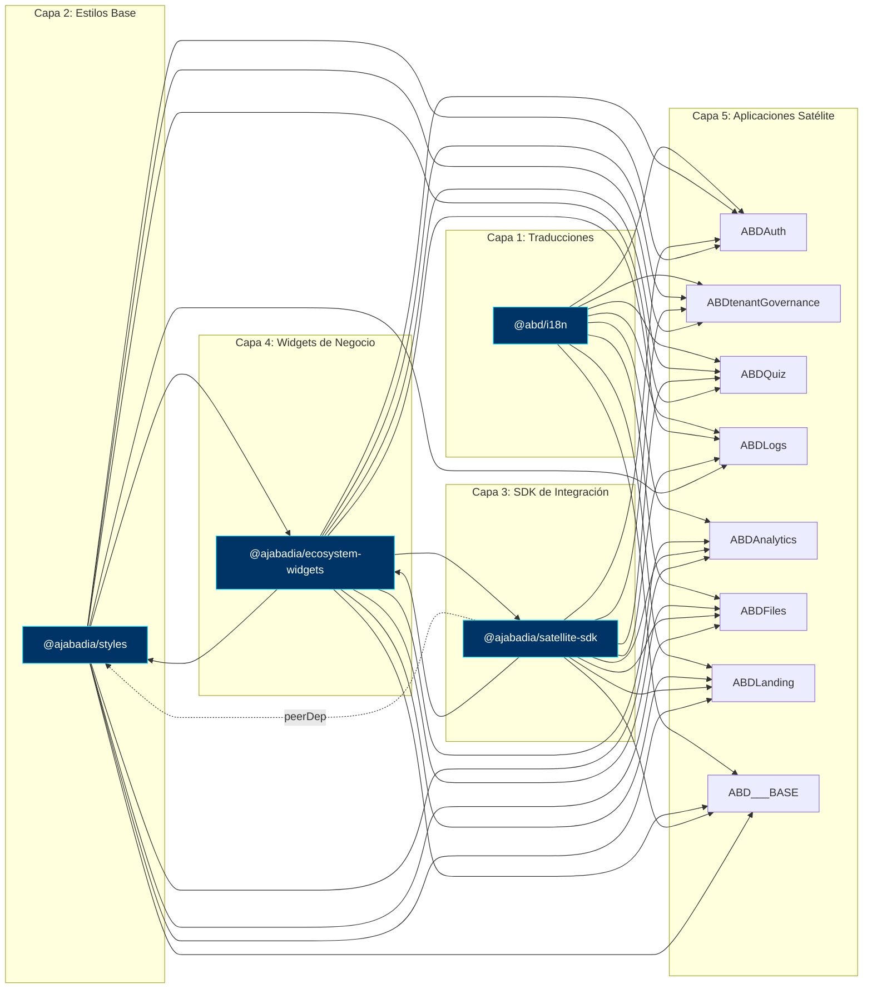
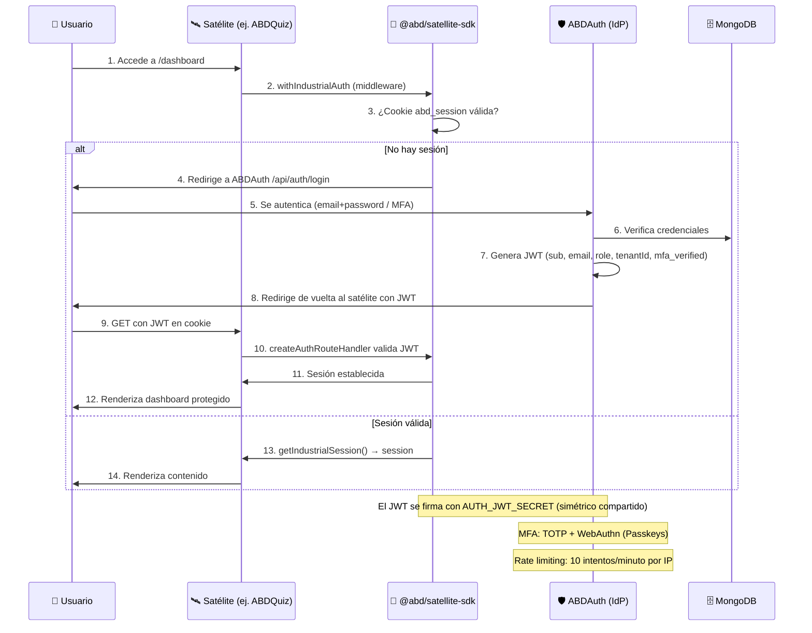
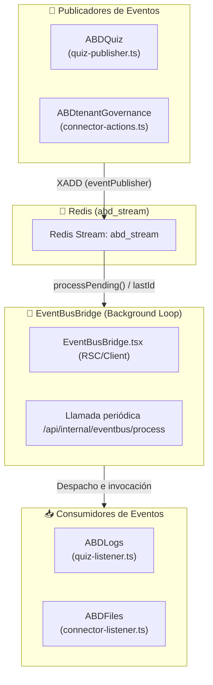
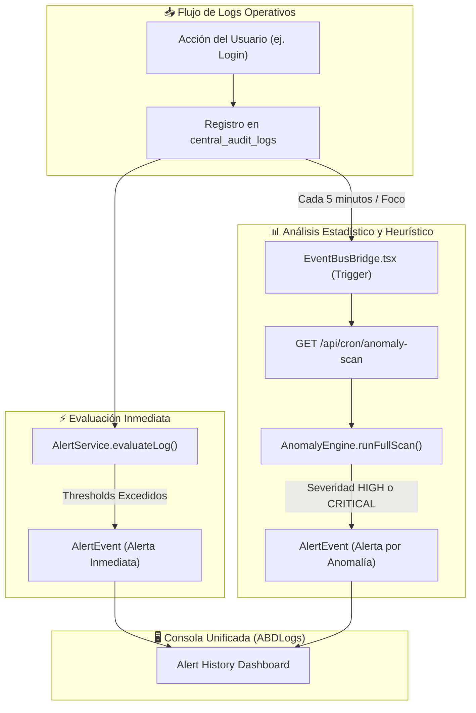
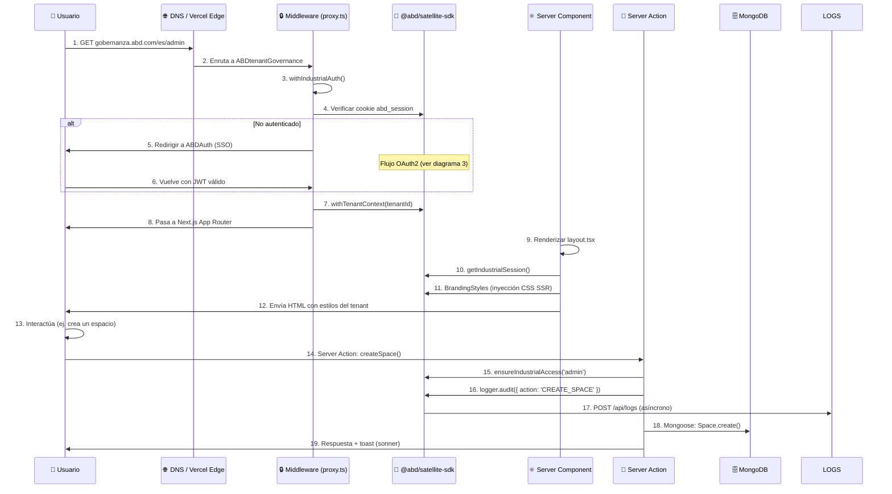
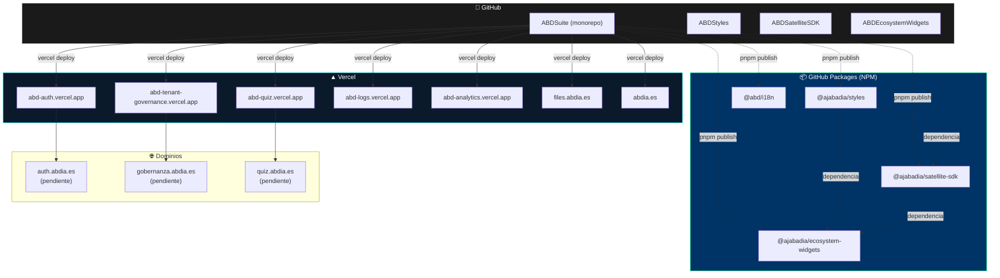

# 🏗️ ABD Suite — Arquitectura del Ecosistema

> **Versión**: 1.0 — Junio 2026
> **Estatus**: `SYS_CERTIFIED`
> **Stack**: Next.js 16 · React 19 · Tailwind CSS v4 · MongoDB/Mongoose 9 · pnpm Workspaces · Turborepo

---

## 📋 Índice

1. [Vista General del Monorepo](#1-vista-general-del-monorepo)
2. [Grafo de Dependencias entre Paquetes](#2-grafo-de-dependencias-entre-paquetes)
3. [Flujo de Autenticación (SSO Federado)](#3-flujo-de-autenticación-sso-federado)
4. [Arquitectura Multi-Tenant](#4-arquitectura-multi-tenant)
5. [Mapa de Interacción entre Servicios](#5-mapa-de-interacción-entre-servicios)
   - [5.1 Arquitectura del EventBus (Mensajería Asíncrona)](#51-arquitectura-del-eventbus-mensajer%C3%ADa-as%C3%ADncrona)
   - [5.2 Estrategia de Pruebas de Integración y E2E (Playwright)](#52-estrategia-de-pruebas-de-integraci%C3%B3n-y-e2e-playwright)
   - [5.3 Monitoreo de Anomalías y Alertas Convergentes](#53-monitoreo-de-anomal%C3%ADas-y-alertas-convergentes)
6. [Ciclo de Vida de una Petición](#6-ciclo-de-vida-de-una-petición)
7. [Pipeline de Calidad y Certificación](#7-pipeline-de-calidad-y-certificación)
8. [Despliegue en Vercel](#8-despliegue-en-vercel)

---

## 1. Vista General del Monorepo

El ecosistema ABD Suite se organiza como un **monorepo** orquestado por `pnpm workspaces` + `Turborepo`. Contiene **4 librerías compartidas** (publicadas como paquetes NPM en GitHub Packages) y **8 aplicaciones satélite** (desplegadas como proyectos independientes en Vercel).

```mermaid
graph TB
    subgraph Root["🏢 Monorepo (ABDSuite)"]
        direction TB
        
        subgraph Libs["📦 Librerías Compartidas (NPM - GitHub Packages)"]
            I18N["@abd/i18n<br/>Traducciones centralizadas"]
            STYLES["@ajabadia/styles<br/>Motor de estilos SSR<br/>Componentes UI"]
            SDK["@ajabadia/satellite-sdk<br/>Auth · Sesión · Logging · Branding"]
            WIDGETS["@ajabadia/ecosystem-widgets<br/>Smart components<br/>SmartNavbar · CommandPalette"]
        end

        subgraph Satellites["🛰️ Aplicaciones Satélite (Vercel)"]
            AUTH["ABDAuth<br/>Identity Provider (IdP)<br/>puerto:5001"]
            TENANT["ABDtenantGovernance<br/>Control Plane<br/>puerto:5002"]
            QUIZ["ABDQuiz<br/>Simulador de Exámenes<br/>puerto:5020"]
            LOGS["ABDLogs<br/>Logging Forense<br/>puerto:5003"]
            ANALYTICS["ABDAnalytics<br/>Analíticas y KPIs<br/>puerto:5004"]
            FILES["ABDFiles<br/>Gestor Documental<br/>puerto:5005"]
            LANDING["ABDLanding<br/>Landing Corporativa<br/>puerto:5000"]
            BASE["ABD___BASE<br/>Template Base<br/>puerto:3900"]
        end
    end

    style Root fill:#0a0a1a,stroke:#00f0ff,stroke-width:2px
    style Libs fill:#0a1a2a,stroke:#00ff88,stroke-width:1px
    style Satellites fill:#1a0a2a,stroke:#ff00ff,stroke-width:1px
```

| Rol | Paquete | Publicado como | Versión |
|-----|---------|---------------|---------|
| Traducciones | `ABDi18n` | `@abd/i18n` | 1.0.37 |
| Estilos | `ABDStyles` | `@ajabadia/styles` | 1.0.89 |
| SDK | `ABDSatelliteSDK` | `@ajabadia/satellite-sdk` | 1.0.84 |
| Widgets | `ABDEcosystemWidgets` | `@ajabadia/ecosystem-widgets` | 1.0.80 |
| IdP | `ABDAuth` | — | 0.1.0 |
| Control Plane | `ABDtenantGovernance` | — | 0.1.0 |
| LMS | `ABDQuiz` | — | 0.1.0 |
| Logs | `ABDLogs` | — | 0.1.0 |
| Analytics | `ABDAnalytics` | — | 0.1.0 |
| Files | `ABDFiles` | — | 0.1.0 |
| Landing | `ABDLanding` | — | 0.1.0 |
| Template | `ABD___BASE` | — | 0.1.0 |

---

## 2. Grafo de Dependencias entre Paquetes

Las librerías compartidas forman una cadena de dependencias que los satélites consumen. El orden de compilación en Turborepo es: `ABDi18n → ABDStyles → ABDSatelliteSDK → ABDEcosystemWidgets → (satélites)`.

---

## 3. Flujo de Autenticación (SSO Federado)

Todos los satélites delegan la autenticación en **ABDAuth** (IdP central) mediante OAuth2. El SDK `@ajabadia/satellite-sdk` abstrae todo el flujo: `withIndustrialAuth` (middleware), `createAuthRouteHandler` (API routes), `getIndustrialSession` (lectura de sesión) y `BrandingStyles` (tema dinámico SSR).

### Componentes del SDK involucrados

| Componente | Ubicación | Propósito |
|-----------|-----------|-----------|
| `withIndustrialAuth` | Middleware (proxy.ts) | Protege rutas, redirige a IdP si no hay sesión |
| `createAuthRouteHandler` | `app/api/auth/[...auth]/route.ts` | Maneja callbacks OAuth2, logout, verificación |
| `getIndustrialSession` | Server Component / API | Lee y descifra la cookie de sesión JWT |
| `ensureIndustrialAccess` | Server Action | Valida rol específico (ej. admin) |
| `BrandingStyles` | Layout (head) | Inyecta CSS dinámico del tenant (Zero-FOUC) |
| `SessionProvider` | Layout (body) | Provee contexto de sesión a client components |

> **⚠️ COOKIE_DOMAIN Caveat (Local Dev):** `COOKIE_DOMAIN=.abdia.es` permite que la cookie `abd_session` sea compartida entre subdominios en producción. Sin embargo, **en localhost el navegador rechaza silenciosamente cualquier cookie con `Domain=.abdia.es`**, causando un redirect loop infinito (middleware satélite → ABDAuth authorize → login → ...). Para desarrollo local, `COOKIE_DOMAIN` debe estar comentado (ver `.env.shared` línea 16).

---

## 4. Arquitectura Multi-Tenant

Cada inquilino (tenant) opera de forma aislada. El sistema soporta tres estrategias de aislamiento configurables por tenant desde `ABDtenantGovernance`.

```mermaid
graph TB
    subgraph ControlPlane["🎮 Plano de Control"]
        GOV["ABDtenantGovernance"]
        GOV --> DB_GOV[(MongoDB: governance<br/>tenants, espacios, usuarios)]
    end

    subgraph TenantA["🏢 Tenant: Academia Alpha"]
        direction TB
        USERS_A["Usuarios Alpha"]
        DATA_A[(MongoDB: abd_tenant_alpha<br/>o colección: alpha_quiz)]
        STORAGE_A["☁️ Cloudinary / Google Drive<br/>(config por tenant)"]
    end

    subgraph TenantB["🏢 Tenant: Corporación Beta"]
        direction TB
        USERS_B["Usuarios Beta"]
        DATA_B[(MongoDB: abd_tenant_beta<br/>o colección: beta_quiz)]
        STORAGE_B["☁️ OneDrive / S3<br/>(config por tenant)"]
    end

    GOV -.->|"Configuración"| TenantA
    GOV -.->|"Configuración"| TenantB

    subgraph Apps["🛰️ Satélites Multi-Tenant"]
        QUIZ["ABDQuiz"]
        LOGS["ABDLogs"]
        FILES["ABDFiles"]
        ANALYTICS["ABDAnalytics"]
    end

    Apps --> TenantA
    Apps --> TenantB

    style ControlPlane fill:#0a1a0a,stroke:#00ff88
    style TenantA fill:#1a1a0a,stroke:#ffff00
    style TenantB fill:#1a0a1a,stroke:#ff00ff
```

### Estrategias de Aislamiento

| Estrategia | Descripción | Cuándo usarla |
|-----------|-------------|---------------|
| `COLLECTION_PREFIX` | Misma base de datos, colecciones prefijadas (`alpha_questions`, `beta_questions`) | Plan gratuito de MongoDB Atlas (1 DB) |
| `DATABASE_PER_TENANT` | Base de datos dedicada (`abd_tenant_alpha`, `abd_tenant_beta`) | Clientes enterprise que requieren aislamiento físico |
| **Híbrido** | Pool de conexiones dinámico con `getTenantModel()` | Transición entre estrategias |

El helper `getTenantModel` (en cada satélite) conmuta automáticamente el modelo Mongoose según el `tenantId` de la sesión, usando `AsyncLocalStorage` para el contexto del hilo de ejecución.

---

## 5. Mapa de Interacción entre Servicios

```mermaid
graph TB
    subgraph Satellites["🛰️ Satélites"]
        QUIZ["ABDQuiz"]
        TENANT["ABDtenantGovernance"]
        FILES["ABDFiles"]
        LANDING["ABDLanding"]
        ANALYTICS["ABDAnalytics"]
    end

    subgraph Core["⚙️ Servicios Centrales"]
        AUTH["ABDAuth<br/>IdP"]
        LOGS["ABDLogs<br/>Logging Forense"]
    end

    subgraph External["☁️ Servicios Externos"]
        MDB[(MongoDB Atlas)]
        CLOUD[Cloudinary]
        S3[AWS S3]
        GDRIVE[Google Drive API]
        ODRIVE[Microsoft Graph API]
        RESEND[Resend<br/>Email Transaccional]
    end

    %% Auth flow
    QUIZ -->|"SSO OAuth2"| AUTH
    TENANT -->|"SSO OAuth2"| AUTH
    FILES -->|"SSO OAuth2"| AUTH
    LANDING -->|"SSO OAuth2"| AUTH
    ANALYTICS -->|"SSO OAuth2"| AUTH

    %% Logging flow
    QUIZ -->|"logger.audit"| LOGS
    TENANT -->|"logger.audit"| LOGS
    FILES -->|"logger.audit"| LOGS
    AUTH -->|"logger.audit"| LOGS
    ANALYTICS -->|"logger.audit"| LOGS

    %% Governance
    TENANT -->|"CRUD tenants, espacios, roles"| AUTH
    FILES -->|"consulta espacios"| TENANT

    %% External storage
    FILES --> CLOUD
    FILES --> S3
    FILES --> GDRIVE
    FILES --> ODRIVE

    %% Database
    AUTH --> MDB
    TENANT --> MDB
    QUIZ --> MDB
    LOGS --> MDB
    FILES --> MDB
    ANALYTICS --> MDB

    %% Email
    AUTH --> RESEND

    style Core fill:#0a1a2a,stroke:#00f0ff,stroke-width:2px
    style Satellites fill:#1a0a2a,stroke:#ff00ff
    style External fill:#0a0a1a,stroke:#00ff88
```

### Protocolos de Comunicación

| Origen → Destino | Protocolo | Autenticación |
|-----------------|-----------|---------------|
| Satélite → ABDAuth | HTTP (OAuth2 redirect) | JWT + cookie de sesión |
| Satélite → ABDLogs | HTTP POST (fetch) | `x-logs-token` (secreto compartido) |
| ABDtenantGovernance → ABDAuth | HTTP (API interna) | `x-internal-iam-key` |
| ABDtenantGovernance → Satélites | HTTP POST (S2S GDPR Export) | `x-internal-secret` (secreto compartido) |
| ABDFiles → Webhooks externos | HTTP POST con HMAC | HMAC-SHA256 firmado |

### 5.1 Arquitectura del EventBus (Mensajería Asíncrona)

Para desacoplar las interacciones y flujos cruzados de la suite (ej. auditoría de exámenes, notificaciones de conectores de storage), se implementa un **EventBus** distribuido basado en **Redis Streams** con fallback automático a MongoDB (en caso de caída de Redis).

- **Mecánica Serverless**: Dado que las aplicaciones corren en entornos serverless (Vercel), los consumidores no pueden mantener listeners persistentes en segundo plano. Esto se resuelve inyectando el componente `<EventBusBridge>` en los layouts de los satélites. El cliente ejecuta un bucle de refresco (background loop) invisible que dispara la acción de procesamiento de eventos en segundo plano (`processPending()`), persistiendo el cursor de lectura `lastId` en Redis.
- **Dashboard de Monitoreo**: Ubicado en `/admin/eventbus` en `ABDLogs` (puerto `5003`), permite visualizar métricas en tiempo real sobre la longitud de los streams de eventos, su estado operativo y la lista de mensajes recientes.

### 5.2 Estrategia de Pruebas de Integración y E2E (Playwright)

El proyecto **`ABDE2E`** unifica las pruebas de integración y flujos transversales de la suite usando Playwright:

1. **Unificación de SSO y MFA (`tests/federated-auth.spec.ts`)**: Valida que la sesión federada única (`abd_session`) sea asignada y compartida entre subdominios locales y que el estado de MFA verificado (`abd_session_verified` con ventana de inmunidad ampliada a 300s) se preserve durante la navegación del usuario.
2. **Pipeline de EventBus (`tests/eventbus-pipeline.spec.ts`)**: Automatiza el flujo completo simulando un alumno que inicia y finaliza un examen en `ABDQuiz`, comprueba que el evento viaja a través del EventBus, y valida que la auditoría con el `attemptId` correcto aparece reflejada en `ABDLogs`.

Las pruebas se ejecutan localmente mapeando el archivo `hosts` del sistema a los dominios `abdia.es`, `auth.abdia.es` y `quiz.abdia.es` para permitir la compartición de cookies de subdominio.

### 5.3 Monitoreo de Anomalías y Alertas Convergentes

El ecosistema unifica la seguridad operacional a través de dos canales complementarios que convergen en el panel **Alert History** de `ABDLogs`:

1. **Evaluación de Logs en Tiempo Real**: Toda entrada enviada a `central_audit_logs` es interceptada y evaluada inmediatamente por `AlertService.evaluateLog()` contra políticas y umbrales (thresholds) definidos. Si se sobrepasan, se eleva al instante un evento `AlertEvent`.
2. **Detección Predictiva de Anomalías (`AnomalyEngine`)**: Un motor heurístico estadístico analiza periódicamente el volumen e irregularidades de eventos por tenant. El pipeline de ejecución es orquestado de forma asíncrona:
   - **Trigger Proactivo**: El puente `<EventBusBridge>` en los clientes Next.js ejecuta un trigger de escaneo al montarse, cada 5 minutos de forma recurrente, y de forma instantánea al recuperar el foco de la pestaña (`visibilitychange`).
   - **Punto de Ingesta**: Llama al endpoint `/api/cron/anomaly-scan` (GET) que mapea todos los tenants activos y ejecuta `AnomalyEngine.runFullScan(tenantId, createAlerts=true)`.
   - **Elevación de Severidad**: Las anomalías identificadas con nivel `HIGH` o `CRITICAL` se transforman automáticamente en alertas operativas, integrándose en el historial de alertas del panel.

---

## 6. Ciclo de Vida de una Petición

Ejemplo completo: un usuario administrador accede al dashboard de `ABDtenantGovernance`.

---

## 7. Pipeline de Calidad y Certificación

Cada satélite ejecuta un pipeline de 6 fases (`abd-audit.ps1`) que debe pasar sin errores para obtener la certificación **Era 11 Compliant**.

```mermaid
flowchart LR
    Start([🔄 Commit / PR]) --> F1

    subgraph F1["Fase 1: Estructural"]
        direction TB
        A1["🔍 Límite de 150 líneas<br/>por archivo"]
        A2["🔍 Sin imports rotos"]
        A3["🔍 CSS unificado presente"]
    end

    F1 --> F2

    subgraph F2["Fase 2: i18n"]
        direction TB
        B1["🌐 Sin textos hardcodeados"]
        B2["🌐 Claves traducidas en es/en"]
    end

    F2 --> F3

    subgraph F3["Fase 3: Accesibilidad"]
        direction TB
        C1["♿ aria-label en botones"]
        C2["♿ roles semánticos"]
    end

    F3 --> F4

    subgraph F4["Fase 4: Pureza"]
        direction TB
        D1["🧹 Sin casteos 'any'"]
        D2["🧹 Sin any genéricos"]
    end

    F4 --> F5

    subgraph F5["Fase 5: TypeScript"]
        direction TB
        E1["📝 tsc --noEmit"]
        E2["📝 0 errores / 0 warnings"]
    end

    F5 --> F6

    subgraph F6["Fase 6: Build"]
        direction TB
        F["📦 next build exitoso"]
    end

    F6 --> Cert{"¿Todo OK?"}

    Cert -->|"Sí ✅"| Certified["🏆 SYS CERTIFIED<br/>ERA 11 COMPLIANT"]
    Cert -->|"No ❌"| Fix["🔧 Corregir y reintentar"]
    Fix --> F1
```

---

## 8. Despliegue en Vercel

Cada satélite se despliega como un proyecto independiente en Vercel, con sus propias variables de entorno.

### Puertos de Desarrollo Local

| Satélite | Puerto | Script de inicio |
|----------|--------|-----------------|
| ABDLanding | `5000` | `start.bat` |
| ABDAuth | `5001` | `start.bat` |
| ABDtenantGovernance | `5002` | `start.bat` |
| ABDLogs | `5003` | `start.bat` |
| ABDAnalytics | `5004` | `start.bat` |
| ABDFiles | `5005` | `start.bat` |
| ABDQuiz | `5020` | `start.bat` |
| ABD___BASE | `3900` | `start.bat` |

> Todos los satélites se inician simultáneamente mediante `start-all.bat` en la raíz.

---

## 🔗 Referencias

- [Roadmap Estratégico de la Suite](./ABD-Suite-DOCS/01_active_specs/ROADMAP.md)
- [Análisis de Arquitectura](./ABD-Suite-DOCS/02_architecture/ANALISIS_ARQUITECTURA.md)
- [Guía de Estilo](./ABD-Suite-DOCS/01_active_specs/STYLE_GUIDE.md)
- [Diagrama de Interrelaciones](./ABD-Suite-DOCS/grafos/Mapa_Global_Suite.md)
