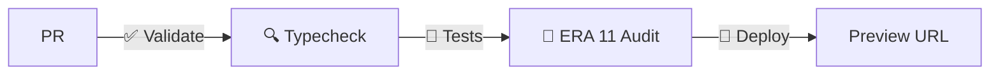

# 🏛️ ABD Suite Monorepo

[](.github/workflows/test.yml)
[](.github/workflows/audit.yml)
[](.github/workflows/deploy.yml)
[](https://turbo.build)
[](https://pnpm.io)
[](https://www.typescriptlang.org)

Plataforma modular SaaS multi-tenant compuesta por **8 paquetes** que conforman el ecosistema ABD.

---

## ⚡ Instalación y Configuración Inicial

### Requisitos Previos

| Herramienta | Versión Mínima |
|-------------|---------------|
| [Node.js](https://nodejs.org) | 20.x |
| [pnpm](https://pnpm.io) | 10.x |
| [Git](https://git-scm.com) | Cualquier versión moderna |

> El proyecto se ha verificado con Node.js v24.16.0 y pnpm 10.25.0.

### 1. Clonar el Repositorio

```bash
git clone https://github.com/ajabadia/ABDSuite.git
cd ABDSuite
```

### 2. Instalar Dependencias del Workspace

```bash
pnpm install
```

### 3. Construir Librerías Fundación

Las librerías compartidas (`ABDStyles`, `ABDSatelliteSDK`, `ABDEcosystemWidgets`) deben compilarse primero ya que los satélites las referencian como dependencias locales:

```bash
cd ABDStyles && pnpm run build && cd ..
cd ABDSatelliteSDK && pnpm run build && cd ..
cd ABDEcosystemWidgets && pnpm run build && cd ..
```

O, alternativamente, ejecutar la build completa del monorepo:

```bash
pnpm build
```

### 4. Configurar Variables de Entorno

Cada satélite necesita un archivo `.env.local` con sus credenciales. El proyecto incluye un script que sincroniza las variables compartidas desde `.env.shared` a cada satélite sin sobrescribir configuraciones locales existentes:

```bash
pnpm run sync-env
```

Luego, completa las credenciales específicas en cada satélite (`MONGODB_URI`, `AUTH_JWT_SECRET`, `CLOUDINARY_URL`, etc.) editando los archivos `ABD*/.env.local` generados.

> **Importante**: Los archivos `.env.local` están en `.gitignore` y no deben committearse. Usa el script `sync-env` para mantener las variables compartidas actualizadas.

### 5. Iniciar el Entorno de Desarrollo

Para lanzar todos los satélites simultáneamente en modo desarrollo:

```bash
pnpm dev
```

Cada satélite corre en su propio puerto:

| Satélite | Puerto |
|----------|--------|
| ABDLanding | 5000 |
| ABDAuth | 5001 |
| ABDtenantGobernance | 5002 |
| ABDLogs | 5003 |
| ABDAnalytics | 5004 |
| ABDFiles | 5005 |
| ABDQuiz | 5020 |

También puedes iniciar satélites individualmente usando su `start.bat` local o ejecutando `pnpm dev` dentro del directorio del satélite.

---

## 🏆 ERA 11 — Certificación Global

Todos los paquetes han superado el pipeline de auditoría **ERA 11** (6 fases: Structural, i18n, a11y, Purity, TypeScript, ESLint).

| Paquete | Estado |
|---------|--------|
| ABDAnalytics | ✅ ERA 11 COMPLIANT |
| ABDAuth | ✅ ERA 11 COMPLIANT |
| ABDFiles | ✅ ERA 11 COMPLIANT |
| ABDLanding | ✅ ERA 11 COMPLIANT |
| ABDLogs | ✅ ERA 11 COMPLIANT |
| ABDQuiz | ✅ ERA 11 COMPLIANT |
| ABDSatelliteSDK | ✅ ERA 11 COMPLIANT |
| ABDtenantGobernance | ✅ ERA 11 COMPLIANT |

> **8/8 paquetes certificados.** El pipeline de auditoría se ejecuta via `pnpm run full-audit` y está integrado en el flujo CI/CD.

---

## 🚀 Scripts Principales

| Comando | Descripción |
|---------|-------------|
| `pnpm dev` | Inicia todos los satélites en modo desarrollo |
| `pnpm build` | Compila todos los paquetes |
| `pnpm run typecheck` | Verifica tipos TypeScript en todos los paquetes |
| `pnpm run test` | Ejecuta tests unitarios (Vitest) en paquetes afectados |
| `pnpm run full-audit` | Ejecuta la auditoría ERA 11 global |
| `pnpm run sync-env` | Sincroniza variables de entorno |

---

## 🤖 Flujo CI/CD

El monorepo cuenta con **3 workflows** de GitHub Actions que se ejecutan automáticamente en PRs y pushes a `main`/`develop`:

| Workflow | Archivo | Trigger | Tiempo |
|----------|---------|--------|--------|
| 🧪 Tests + Typecheck | `test.yml` | PR + push a `main`/`develop` | ~1–2 min |
| 🔬 ERA 11 Global Audit | `audit.yml` | PR + push a `main`/`develop` | ~5 min |
| 🚀 Vercel Deploy | `deploy.yml` | PR (preview) + push a `main` (prod) | ~3 min |

### Orden de ejecución en PR



1. **✅ Validate YAML** — Valida sintaxis de todos los `.github/workflows/*.yml`
2. **🔍 Typecheck** — `tsc --noEmit` en paquetes afectados por los cambios
3. **🧪 Tests** — `vitest run` en paquetes afectados (usa detección de Turborepo `--filter=...[origin/main]`)
4. **🔬 ERA 11 Audit** — Pipeline completo de 6 fases en los 8 paquetes
5. **🚀 Deploy (preview)** — Despliegue en Vercel con URL de preview por PR

> En push a `main` se ejecutan todos los workflows secuencialmente y se despliega a producción.

---

## 📦 Paquetes del Ecosistema

### Aplicaciones (Next.js 16)
- **ABDAnalytics** — Analíticas y métricas multi-tenant
- **ABDAuth** — Autenticación y autorización federada
- **ABDFiles** — Gestor documental con proveedores externos. Incluye **motor de conversión universal** con 6 engines: Pandoc (documentos, 30+ formatos), Sharp (imágenes), FFmpeg (audio/video), Tesseract.js (OCR), Whisper (STT) y Kokoro (TTS). Conversión servidor (`/api/v1/convert/*`) y local (browser WASM). Soporte de pipelines multi-step (ej. video → documento).
- **ABDLanding** — Landing page institucional
- **ABDLogs** — Logs forenses multi-tenant
- **ABDQuiz** — Módulo LMS de cuestionarios
- **ABDtenantGobernance** — Panel de gobernanza multi-tenant

### Librerías Compartidas
- **ABDStyles** — Tokens CSS, temas HSL y utilidades visuales Tech-Noir (`industrial-core.css`)
- **ABDEcosystemWidgets** — Componentes de UI compartidos: `AppSidebarNavigation`, `SmartNavbar`, `SystemSettings`, `TenantSelector`, `CommandPalette`, `ConfirmDialog`, API clients de espacios y grupos
- **ABDSatelliteSDK** — SDK compartido con autenticación federada, logger, event bus, contratos Zod y utilidades cross-cutting
- **ABDi18n** — Traducciones centralizadas ES/EN consumidas por todos los satélites vía `next-intl`

---

## ⚙️ Tecnologías Principales

| Tecnología | Versión |
|------------|---------|
| [Next.js](https://nextjs.org) | 16.x |
| [React](https://react.dev) | 19.x |
| [TypeScript](https://www.typescriptlang.org) | 6.0 |
| [pnpm](https://pnpm.io) | 10.x |
| [Turborepo](https://turbo.build) | 2.x |
| [Mongoose](https://mongoosejs.com) | 9.x |
| [next-intl](https://next-intl-docs.vercel.app) | 4.x |
| [Vitest](https://vitest.dev) | 4.x |

---

## 🧪 Auditoría ERA 11

La certificación **ERA 11** verifica 6 fases en cada paquete:

1. **Structural** — Validación de estructura de archivos
2. **i18n** — Internacionalización y paridad de claves
3. **a11y** — Accesibilidad (labels, roles, aria-*)
4. **Purity** — Pureza de código (sin `as any`, tipos genéricos)
5. **TypeScript** — Compilación estricta (`tsc --noEmit`)
6. **ESLint** — Calidad de código

```bash
# Ejecutar auditoría global
pnpm run full-audit
```
